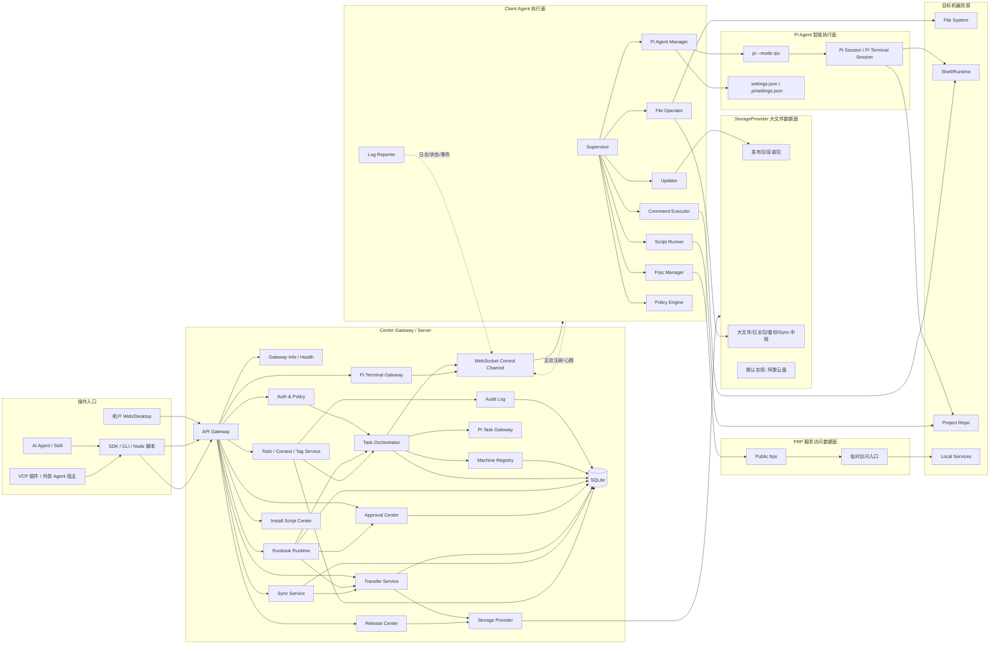

# 02. 系统架构设计

## 总览图



## 控制面

Gateway 负责平台级控制：认证、权限、任务、机器、发版、安装、审计、PiTask 封装、Runbook 编排、Approval、Transfer/Sync 状态机、Todo/Context/Tag 协作资源。Gateway 不直接进入目标机器执行命令，也不经手大文件本体；Gateway 也不主动调用 VCP，只暴露通用 API。

## 执行面

Client Agent 运行在目标机器上，主动连接 Gateway。它是目标机器安全边界，负责执行任务和托管 Pi Agent。

## 智能执行面

Pi Agent 被 Client 托管，用于项目级智能任务：代码分析、依赖修复、部署脚本生成、远程排错。分两种形态：

- `pi.run`：自动批处理，底层 `pi --mode rpc` 单向驱动（发 prompt→只读事件→agent_end 关进程），见 05。
- `pi.terminal`：交互式 Web 终端，底层 `pi --mode rpc` 双向 attach，长生命周期、可重连，见 05b。

二者共用 Client 的 `rpc-process-host`。Provider Profile 可按 Machine Policy 选择本地 settings、Gateway 集中注入或 fallback。

## SDK 集成面

`@noesis/sdk` 是 CLI、Node 脚本、桌面程序、AI skill 和 VCP 插件的统一集成层。SDK 通过 Gateway HTTP API / WebSocket 访问能力：发起 Task、观察事件、管理 Runbook、处理 Approval、执行 Transfer/Sync、管理 Todo/Context/Tag、attach Pi Terminal。SDK 不本地执行 Runbook，也不把大文件字节穿 Gateway WebSocket。通用 AI Agent 通常走 skill + CLI；VCP 这类 Node 插件宿主可直接 import SDK。

## 大文件数据面

StorageProvider 负责发布包、大文件导入导出、日志包、备份包和 Sync 中转；第一版默认实现是阿里云盘。

**核心架构**：Server 管理 StorageProvider 认证与元数据，Client/浏览器获取临时凭证直传。Server 永远不经手大文件本体，仅负责：

1. Provider 令牌管理（如 AliyunDrive 的 clientId/clientSecret/accessToken/refreshToken 持久化在 Server DB）
2. 创建上传/下载任务（调用 Provider API 创建对象、获取分片上传 URL）
3. 分发临时凭证 URL（将 accessToken + uploadUrl/downloadUrl 下发给 Client/浏览器）
4. 追踪传输状态机（waiting_cli_upload → cli_uploading → provider_uploaded → waiting_client_download → client_downloading → completed）
5. 传输完成后自动清理 Provider 中转文件（默认 24h TTL）
6. 记录 SyncJob / TransferJob 进度，供 SDK/CLI/桌面端断点续传与目录同步恢复

Client 不接触 Provider client_id/client_secret，仅通过 Server 下发的临时凭证直传。详见 13。

## 服务访问数据面

FRP 负责临时暴露目标机器内部服务。映射必须短生命周期、可审计、可关闭。

## 通信模型

| 链路 | 用途 |
|---|---|
| HTTP API | 用户/SDK/CLI/AI/VCP 创建任务、查询状态、配置管理、云盘认证、Runbook、Approval、Transfer/Sync、Todo/Context/Tag |
| WebSocket | Client 注册、心跳、任务下发、日志回传、Task/Runbook/Transfer/Sync 事件流、Pi Terminal attach |
| StorageProvider | 大文件上传/下载/发布包分发/Sync 中转；默认 AliyunDrive，后续可换 S3/WebDAV/MinIO（Server 管理认证，Client/浏览器/SDK 凭凭证直传，不经 Server 本体） |
| FRP | 临时访问目标服务，以及 direct/frps_chunked 传输模式 |

## 任务生命周期

```text
created -> queued -> waiting_client -> dispatched -> running -> succeeded/failed/canceled/timeout
```

## 关键边界

- 命令、文件、Pi、更新都必须通过 Task。
- RunbookRun 是跨机器编排实例，不伪装成单个 Task；能力调用才生成 Task / Transfer / Approval。
- Approval 是一等实体，Task / RunbookRun 只保留审批状态摘要。
- Todo 是协作计划资源，不是执行通道；VCP 通过 SDK 轮询 ready 叶子 Todo，执行仍落到既有 Task/Runbook/File/Pi 能力。
- Client 不长期暴露控制 HTTP API。
- Pi 不直接暴露公网。
- 大文件不经 Server 应用中转，WebSocket 只承载控制与进度。
- FRP 不作为默认控制链路。
