# 03. 领域模型设计

## 核心实体图

```mermaid
classDiagram
  class Machine { string id; string name; string os; string arch; string status; string clientVersion; json capabilities }
  class Task { string id; string type; string status; string machineId; json payload; json result }
  class TaskEvent { string id; string taskId; string eventType; json data }
  class Runbook { string id; string name; string latestVersionId; json paramsSchema }
  class RunbookVersion { string id; string runbookId; int version; string code }
  class RunbookRun { string id; string runbookId; string runbookVersionId; string status; json params }
  class Approval { string id; string source; string status; string runbookRunId; string taskId; string riskLevel }
  class TransferJob { string id; string machineId; string status; string mode; int totalBytes }
  class SyncJob { string id; string machineId; string direction; string status; json manifest }
  class Release { string id; string version; string component; string channel; json manifest }
  class ReleaseArtifact { string id; string releaseId; string os; string arch; string sha256; string storageFileId }
  class InstallToken { string id; string tokenHash; int maxUses; int usedCount; datetime expiresAt }
  class PiSession { string id; string taskId; string projectPath; string status; json summary }
  class PiTerminalSession { string id; string machineId; string projectPath; string piSessionFile; string status; string render; string ownerToken }
  class FrpMapping { string id; string machineId; string protocol; int localPort; int remotePort; string status }
  class AuditLog { string id; string source; string actor; string action; string targetType; string targetId; string machineId; string taskId; string riskLevel; json detail; string result; string requestId }
  class IdempotencyRecord { string keyHash; string method; string path; string responseRef; datetime expiresAt }

  Machine --> Task
  Task --> TaskEvent
  Task --> PiSession
  Task --> AuditLog
  Machine --> PiTerminalSession
  Release --> ReleaseArtifact
  Machine --> FrpMapping
  InstallToken --> Machine
  Runbook --> RunbookVersion
  RunbookVersion --> RunbookRun
  RunbookRun --> Task
  RunbookRun --> Approval
  RunbookRun --> TransferJob
  Task --> Approval
  SyncJob --> TransferJob
  Machine --> TransferJob
  Machine --> SyncJob
```



## Machine

Machine 是 Gateway 调度的能力载体。

字段：

- id：安装时生成，长期不变。
- name：用户可修改。
- os / arch / hostname。
- status：online / offline / updating / error / disabled。
- clientVersion。
- capabilitiesJson。
- tagsJson。
- policyJson：Machine Policy 单一事实源（见 13），Gateway 落库、经控制通道下发到 Client 只读镜像执行。**含 piPolicy 子对象**（见下）。

### PiPolicy（Machine Policy 子对象）

Pi 专属策略，嵌套在 `machines.policy_json` 的 `piPolicy` 字段：

- defaultProfileId：默认 Provider Profile ID。
- keyInjection：Key 注入模式 — `managed`（Gateway Profile，隔离临时目录）/ `fallback`（本地优先，缺失用 Gateway）/ `local_only`（只用本地 ~/.pi/agent/）。
- projectTrust：项目信任策略 — `always`（--approve）/ `never`（--no-approve）/ `ask`（按 saved trust）。
- defaultTimeoutSeconds：Pi 任务默认超时。
- toolMode：工具权限默认 — `full`/`readonly`/`custom`，映射到 Pi `--tools`/`--exclude-tools` flag。
- customTools：toolMode=custom 时的工具白名单。
- policyGate：危险操作拦截配置 — enabled/rules/autoAction，Client 侧拦截（仅 pi.terminal 交互有效，pi.run 自动拒绝）。

> **注意**：`allowedPaths`/`blockedPaths` 在 policyJson 顶层，只约束 file.* 操作，不约束 Pi 工作目录。Pi 可在任意目录运行，projectPath 由每次任务指定。

- disksJson：磁盘清单数组（见下），Client 心跳上报，Gateway 落库。**理念：用户对机器有权限 = 所有盘/分区全部可见可管，不设人为限制。**
- lastSeenAt。

### DiskInfo（多盘/多分区模型）

```ts
interface DiskInfo {
  name: string;      // Windows: "C:"  Linux: "/"  macOS: "Macintosh HD"
  mount: string;     // 挂载点（Windows 同 name，Linux/macOS 是路径）
  totalBytes: number;
  usedBytes: number;
  freeBytes: number;
  usagePct: number;  // 使用率 %
  fsType: string;    // ntfs / ext4 / xfs / apfs / tmpfs / exfat ...
  readonly: boolean; // 只读盘（如恢复分区、只读挂载）
  system: boolean;   // 是否系统盘（C: / / / Macintosh HD）
  label?: string;    // 卷标（Windows 可选，如 "数据"/"备份"）
}
```

**设计考量：**

- Windows：每个盘符（C:/D:/E:…）一个 DiskInfo，无论系统盘/数据盘/外置盘，全部上报。
- Linux：每个挂载点（/ /home /var /data /mnt/xxx…）一个 DiskInfo，包括 tmpfs、外挂盘、网络挂载（标记 readonly）。
- macOS：每个卷（Macintosh HD、/Volumes/xxx）一个 DiskInfo。
- 离线机器：disks 为空数组，UI 显示"机器离线，无数据"。
- 预警：usagePct ≥ 85% 红色、≥ 70% 橙色。系统盘高使用率优先告警。
- 业务联动：file.write / file.import_from_cloud / pi.run 执行前，Gateway 校验目标路径所在盘的 freeBytes 是否充足（见 04 File Operator / 07 Files）。

能力清单示例：

```json
{
  "file": true,
  "command": true,
  "script": true,
  "frpc": true,
  "selfUpdate": true,
  "piAgent": {
    "installed": true,
    "ready": true,
    "version": "0.74.x",
    "rpcMode": true,
    "piTerminal": true
  },
  "browserUse": {
    "available": true,
    "adapter": "cdp",
    "fallbackToComputerUse": true
  },
  "computerUse": {
    "installed": true,
    "available": true,
    "policyEnabled": false,
    "adapter": "enikk"
  },
  "runtimes": {
    "node": "24.x",
    "npm": true,
    "git": true,
    "powershell": true,
    "bash": true
  }
}
```

> **注 - Pi 就绪判定**：`piAgent.ready` 是该机器 Pi Agent 是否可用的核心布尔标志。Gateway 在仪表盘上聚合所有在线机器的此字段，计算"Pi 就绪率"KPI（见 11 UI/UX 设计）。`ready` 为 true 的前提是 `installed` 为 true 且 Pi 进程可正常启动。

## API Token

API Token 是 CLI / SDK / skill / 外部脚本的可撤销访问凭证。

第一版不做 scope 或机器范围限制；字段只保留 name、tokenHash、expiresAt、revokedAt、source、actor、createdAt。安全边界先由 Gateway 鉴权、Machine Policy、Approval、Audit 承担。

## Task

所有单机远程动作都归一为 Task。跨机器编排使用 RunbookRun，不伪装成一个 Task。

任务类型：

```text
file.list/read/write/delete/move/copy/rename/mkdir/import_from_cloud/export_to_cloud
command.run
script.run
pi.check/install/configure/run/cancel
frp.open/close
browser.run/browser.macro.run/browser.doctor/browser.repair
computer.run/computer.install/computer.enable/computer.disable/computer.doctor/computer.repair/computer.macro.run
automation.macro.run/automation.report.get
client.update/restart/health_check
server.update
install.register
```

状态：

```text
created queued waiting_client dispatched running succeeded failed canceling canceled timeout
```

> 审批不进入 `status`：命中 `requireApprovalFor` / Runbook `approve()` / `cmd({approve:true})` 时，`status` 保持 `running`，另由独立字段 `approval_status`（`not_required`/`waiting_confirm`/`approved`/`rejected`/`timeout`）跟踪，同时创建一条 Approval 实体，见 08/09/17。`rollbacking`/`rollbacked` 不属 Task 状态——回滚是 Client/Server 自更新流程的内部状态（见 09 自更新状态机）。

## TaskEvent

记录任务流式过程：

```text
task.created task.dispatched task.started stdout stderr progress file.changed pi.event pi.command pi.summary frp.opened update.stage task.succeeded task.failed
```

## Runbook / RunbookVersion / RunbookRun

Runbook 是 TS DSL 编排定义；RunbookVersion 保存每次代码更新的不可变版本；RunbookRun 是一次执行实例。

- Runbook：id、name、description、latestVersionId、paramsSchema、dangerousOverride、tags、lastExec 摘要。
- RunbookVersion：id、runbookId、version、code、paramsSchema、createdAt。
- RunbookRun：id、runbookId、runbookVersionId、params、status、snapshotJson、traceJson、source、actor、createdAt、finishedAt。

RunbookRun 状态：`created` / `running` / `waiting_approval` / `succeeded` / `failed` / `canceling` / `canceled` / `timeout`。

## Approval

Approval 是一等实体，统一承接 Runbook 确认门、命令级确认、policy gate。

字段：id、source（runbook_gate / command_option / policy_gate）、status（waiting / approved / rejected / timeout）、runbookRunId、taskId、machineId、message、riskLevel、contextJson、decision、decidedAt、createdAt。

## Todo / Tag / Context

Todo 是独立资源域，不依附 Runbook。Tag 只做分类；Context 是可复用执行信息包；Todo 通过 tagIds 和 contextId 组合分类与执行上下文。VCP 作为 Gateway 的 agent 用户，通过 SDK 轮询 ready 的叶子 Todo，自主 claim、执行并 report。完整设计见 `20-todo-vcp-collaboration.md`。

核心规则：

- `Tag`：纯分类资源，删除=归档。
- `Context`：独立活文档，含 `machineIds[]` 和 markdown，删除=归档。
- `Todo`：单表自引用，限两层；有子任务的父 Todo 不可 claim，叶子 Todo 可 claim。
- `ready` 只在叶子 Todo 上有效，由用户手拨，是 VCP 可领取的闸门。
- 父 Todo status 由子任务事务联动维护；子任务全 done 后父进入 `awaiting_confirmation`，由用户 confirm 后 done。
- 执行轨迹不复制到 Todo，VCP report 的 `executedTaskIds[]` 通过 `todo_task_links` 关联到既有 Task/audit 链路。

状态：

```text
todo doing awaiting_confirmation done failed
```

## TransferJob / SyncJob

TransferJob 表示单文件传输；SyncJob 表示目录同步，下面挂多个 TransferJob。

- TransferJob：machineId、rootId、targetDir、filename、size、mode、status、uploadedBytes、downloadedBytes、writtenBytes、cleanup 状态。
- SyncJob：machineId、direction（upload / download）、localRoot、remoteRoot、mode、compare、deleteExtra、conflict、manifestJson、status、progress、source、actor。

SyncJob 状态：`created` / `planning` / `syncing` / `paused` / `completed` / `failed` / `cancelled`。

## PiSession

一次 `pi.run` 批处理任务的会话记录（底层 `pi --mode rpc` 单向驱动）：

- taskId（必填，归属某个 Task）
- prompt
- projectPath
- events
- commands
- changedFiles
- summary
- sessionStats（token/cost）
- status

## PiTerminalSession

一次 `pi.terminal` 交互式 Web 终端会话（见 05b），**不是 Task**，经 HTTP + WS attach 打开：

- id
- machineId
- projectPath
- piSessionFile（Client 本地 session JSONL 路径）
- render（console / raw）
- ownerToken
- status：opened / attaching / attached / detached / closing / closed / error
- lastAttachAt
- exitCode / closeReason

状态机见 09。

## Release

组件版本：

```text
server client pi-agent-bundle frpc plugin
```

Release 的中心是 manifest，而不是单个文件。

## AuditLog

审计日志是操作回放与来源追溯依据（个人单用户系统，审计的核心是"这条操作从哪里来"而非"谁做的"）：

- source：web / cli / sdk / desktop / skill / ai-agent（操作来源入口；通用 AI Agent 经 skill + CLI 调用时归 cli，VCP 这类 SDK 插件归 ai-agent）
- actor：来源子标识（如 cli 下的 skill 名 / agent 名，或 `vcp:<agentName>`；web 下留空）
- action
- targetType / targetId
- machineId / taskId：关联机器与任务（可空，全局/非任务操作无）
- riskLevel
- detail：payload 摘要，敏感字段脱敏
- result
- requestId

## IdempotencyRecord

创建型 API 的幂等记录，防止脚本重跑或网络重试导致重复创建副作用。

字段：keyHash、tokenHash、method、path、payloadHash、responseJson、responseRefType、responseRefId、expiresAt、createdAt。

作用域：token + method + path + Idempotency-Key。同 key 同 payload 返回首次响应；同 key 不同 payload 返回 `IDEMPOTENCY_CONFLICT`。
