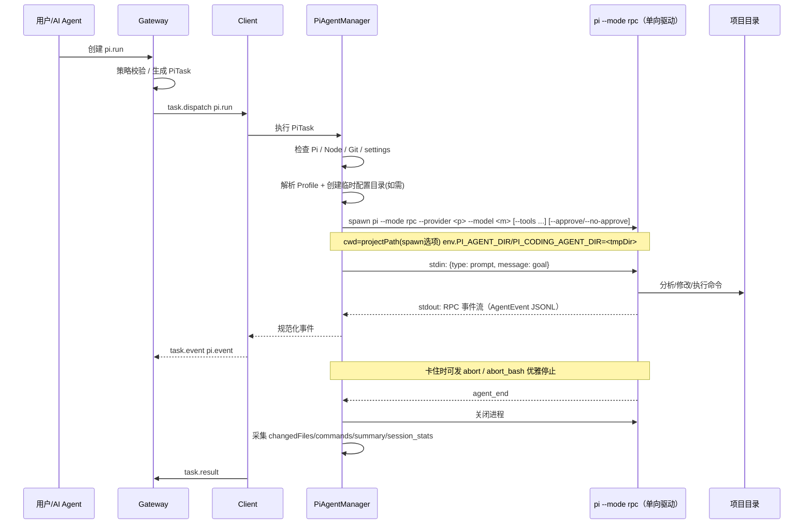

# 05. Pi Agent 集成设计

## 定位

Pi Agent 是目标机器上的项目级智能执行器。Client Agent 是机器级基础执行器，Gateway 是统一调度者。

```text
Gateway -> Client Agent -> Pi Agent -> Project Repo
```

Pi Agent 不直接暴露公网，不直接被 Gateway 远程连接。Gateway 下发标准 PiTask JSON，由 Client Agent 的 PiAgentManager 托管 Pi 进程。

> **注 - Pi 就绪评估**：Client 的 PiAgentManager 首先检查 Pi 是否 installed/ready（即 `capabilities.piAgent.ready`），若未就绪则返回错误结果，仪表盘对应机器 Pi 状态为未就绪，影响全局"Pi 就绪率"KPI（见 11 UI/UX）。Pi 就绪率 = 已就绪在线机器 ÷ 总在线机器。

## 典型场景

- 修复 Node / npm / nvm 路径问题。
- 检查项目依赖。
- 执行测试并修复失败。
- 根据日志定位问题。
- 生成部署脚本。
- 初始化 `.pi/settings.json`。
- 生成项目 Runbook。

## PiTask JSON

```json
{
  "type": "pi.run",
  "taskId": "task_20260618_001",
  "machineId": "win-dev-01",
  "projectPath": "D:/any/dir/OptiMinder",
  "goal": "修复项目依赖问题",
  "prompt": "请检查 package.json、Node 版本、npm 依赖，并修复项目启动失败问题。",
  "providerProfileId": "profile_001",
  "constraints": {
    "toolMode": "full",
    "customTools": null,
    "appendSystemPrompt": "不要覆盖用户本地配置，所有修改前先说明原因",
    "timeoutSeconds": 3600,
    "policyGate": {
      "enabled": true,
      "rules": ["rm -rf", "git push", "drop table", "system_service_change"],
      "autoAction": "reject"
    }
  },
  "environment": {
    "cwd": "D:/any/dir/OptiMinder",
    "approveMode": "always"
  },
  "resultPolicy": {
    "collectChangedFiles": true,
    "collectCommands": true,
    "collectSummary": true
  }
}
```

> **PiTask JSON v2 校准说明**：projectPath 不受 allowedPaths 限制，Pi 可在任意目录运行。environment.cwd 为 spawn 的 cwd 选项（Pi 没有 `--cwd` flag）。constraints.toolMode（full/readonly/custom）替代旧 allowShell/allowFileEdit/allowInstallDeps/allowNetwork，映射到 Pi `--tools`/`--exclude-tools` flag。constraints.policyGate 是 PiTask 的 Pi 级危险命令拦截字段（与文件级 `requireApprovalFor` 并存：后者在 policyJson 顶层约束 file.* 操作，前者在 piPolicy 内约束 Pi 工具调用，见 13），为 Client 侧拦截（仅 pi.terminal 交互有效，pi.run 自动拒绝）。constraints.appendSystemPrompt 映射到 `--append-system-prompt` flag（软约束）。environment.approveMode 映射到 `--approve`/`--no-approve`（控制 Pi 的 project trust 行为）。providerProfileId 指定用哪个 Provider Profile（见下）。已删除无效字段：maxOutputBytes/preferredShell/packageManager/loadProjectInstructions/extraInstructions。

## 执行流程



## 底层模式：rpc 单向驱动（不再用 json）

`pi.run` 底层从 `pi --mode json` 改为 `pi --mode rpc` 的**单向驱动**用法：

```text
spawn pi --mode rpc
  → stdin 发 {type: prompt, message: goal}
  → 只读 stdout 事件流
  → 收到 agent_end 后主动关闭进程
```

任务语义、协议层（`pi.run` 任务类型、`PiTask JSON`、`pi.event` 规范化、审计）**完全不变**。改变的只是进程怎么跑、怎么停。

### 为什么不用 json

json 模式是单向的，prompt 发出后**没有任何干预手段**，唯一兜底是外部硬超时 kill。对自动批处理意味着：

- 某条 bash hang（npm 卡网络、命令等输入）→ 只能等整任务超时重来，前面的活可能白干。
- LLM 工具死循环 → 只能硬 kill，拿到截断的不完整结果。
- 无法判断“LLM 在思考/在压缩上下文”还是“真卡死”，watchdog 只能靠 wall-clock 超时，容易误杀。

json 唯一的好处是“跑完自动 exit、防呆”。rpc 单向驱动补上“收到 `agent_end` 后主动关进程”这一点即可，防呆性对齐。

### rpc 单向驱动白捡的能力

| 能力 | 价值 | 说明 |
|---|---|---|
| `abort_bash` | 高 | 停单条 hang 的 bash，会话不废，Pi 可自行决定重试/换法。json 下做不到。 |
| `abort` | 中 | 优雅停止，拿 `agent_end(aborted)` 干净收口，避免硬 kill 丢 buffer / 留半截文件。 |
| `get_state` | 中 | 智能 watchdog：区分 `isStreaming`/`isCompaction` 与真卡死，少误杀。 |
| `get_session_stats` | 低 | 任务结束直接拿 token/cost，不用事后估算。 |

> **不依赖 steer**：自动批处理靠 prompt + constraints，不靠中途 steer。Gateway 自动 steer 会引入新决策点和风险，本设计不采用。rpc 的 steer 能力留给交互式 `pi.terminal`（见 `05b`）。

### 与 pi.terminal 共用底层

`pi.run` 与 `05b` 的 `pi.terminal` 共用 Client 的 `rpc-process-host`（spawn `pi --mode rpc`、双向 JSONL pipe、事件规范化）。区别只是用法：

- `pi.run`：单向驱动，收到 `agent_end` 就关进程，无人交互。
- `pi.terminal`：双向 attach，长生命周期，等用户重连。

只维护一套进程托管代码。json 模式降级为“极简兜底”，仅在 rpc 进程无法 spawn 时回退。

### 单向驱动必须处理的点

1. **收到 `agent_end` 后主动关进程**，防止泄漏（json 自动 exit，rpc 不会）。
2. **扩展 UI 请求自动拒绝**：自动批处理无人点弹窗，命中 `extension_ui_request` 时回 `cancelled: true`，并把交互需求写审计（提示用户改用 `pi.terminal`）。
3. **卡住兜底**：先 `abort` 优雅停 → 等待 `agent_end` → 仍无响应再 SIGTERM→SIGKILL。JSONL 流式，前面事件不丢，最终 `result.status=timeout/aborted` 带 `partial=true`。

## Pi 配置分层

```text
Gateway Provider Profile（全局）
  -> Machine Pi Policy（piPolicy 子对象）
    -> 项目上下文（AGENTS.md 自动加载）
      -> Single PiTask Constraints
```

### Gateway Provider Profile

- 全局 Provider Profile（默认 URL/Key/消息类型/模型清单）。
- 默认模型 / 默认 Provider（由 Profile 内 settings.json 决定）。
- 默认超时。

### Machine Policy（piPolicy 子对象）

- 默认 Provider Profile ID。
- Key 注入模式：`managed` / `fallback` / `local_only`。
- 项目信任策略：`always` / `never` / `ask`。
- 工具权限默认：`full` / `readonly` / `custom`。
- policyGate：危险操作拦截规则。
- 默认超时。

> Machine Policy 的单一事实源是 Gateway DB 的 `machines.policy_json`（见 03/08），不在 Client 本地 config 定义。Gateway 经控制通道 `machine.policy.sync` 下发，Client 持只读镜像执行（断网仍可用最后缓存）。
>
> **注意**：`allowedPaths`/`blockedPaths` 在 policyJson 顶层，只约束 file.* 操作，不约束 Pi 工作目录。Pi 可在任意目录运行，projectPath 由每次任务指定。

### 项目上下文（自动加载）

项目说明 / 启动命令 / 测试命令 / 编码规范 / 禁止修改目录由 Pi 自动从 cwd 向上查找 `AGENTS.md`/`CLAUDE.md` 加载，无需 Gateway 配置。`AGENTS.md`/`CLAUDE.md` 无论 project trust 都会加载。

### Task Constraints（Pi 原生）

- toolMode：工具权限（full/readonly/custom），映射到 `--tools`/`--exclude-tools` flag。
- appendSystemPrompt：安全指令软约束，映射到 `--append-system-prompt` flag。
- policyGate：危险操作 Client 侧拦截规则（pi.terminal 交互有效，pi.run 自动拒绝）。
- timeoutSeconds：wall-clock 兜底超时。

> **已删除的无效字段**（Pi 不支持）：allowShell / allowFileEdit / allowInstallDeps / allowNetwork / maxOutputBytes。Pi 危险命令拦截改由 `piPolicy.policyGate` 负责；文件级 `requireApprovalFor` 保留在 policyJson 顶层（两者并存，见 13）。

## Provider Profile 与 Key 注入

Pi 的 Provider 配置（自定义 URL / 消息类型 / API Key / 模型清单）通过 Gateway 的 Provider Profile 集中管理，下发到目标机时采用隔离临时配置目录方案。

### Provider Profile

存储在 Gateway DB `pi_provider_profiles` 表（见 08），每个 Profile 包含完整的 Pi models.json Provider 配置：

- provider_key：models.json 的 providers key。
- base_url：自定义代理 URL。
- api_type：消息类型（openai-completions/openai-responses/anthropic-messages/google-generative-ai）。
- api_key_enc / api_key_env_ref：Key 存储（加密落库 / 引用环境变量 / 不需要）。
- models_json：模型清单。
- headers_json / compat_json：高级配置。

Profile 分两层：全局（scope=global，所有机器可见）+ 机器级覆盖（scope=machine，仅该机器可见）。

### 隔离临时配置目录

managed/fallback 模式下，Client 为每个 PiTask/PiSession 创建临时目录 `<system-tmp>/noesis-pi-<taskId>/`，合成为：

- `settings.json`：{ defaultProvider, defaultModel, defaultThinkingLevel }
- `models.json`：{ providers: { <key>: { baseUrl, api, apiKey, headers, models, compat } } }
- `auth.json`：{ <key>: { type: "api_key", key: <decrypted> } }（0600）

通过 Pi 配置目录环境变量指向临时目录。落地前必须实测 `pi --mode rpc` 支持的变量名；兼容方案是同时设置 `PI_AGENT_DIR=<tmpDir>` 与 `PI_CODING_AGENT_DIR=<tmpDir>`（已知 pi-webui 读取 `PI_AGENT_DIR`）。Pi 进程退出后清理。`local_only` 模式跳过临时目录，直接用本地 `~/.pi/agent/`。

### Key 注入模式

| 模式 | 行为 | 适用 |
|---|---|---|
| `local_only` | 只用目标机本地 ~/.pi/agent/，不创建临时目录 | 本地已有完整配置 |
| `managed` | 用 Gateway Profile，创建隔离临时目录 | 集中管控（默认） |
| `fallback` | 本地优先，本地缺对应 provider 时用 Gateway Profile | 过渡场景 |

### Key 安全

- 加密 Key（api_key_enc）经 TLS WebSocket 下发到 Client，写入临时 auth.json（0600），进程退出后删除。
- 环境变量引用（api_key_env_ref）不落库，Client 从目标机环境读取。
- 审计脱敏：Key 永不出现在事件、日志、payloadSummary（见 13）。

### Pi 工作目录

Pi 工作目录（projectPath）不受 Machine Policy 的 allowedPaths 限制。allowedPaths 只约束 file.* 操作。Pi 可在任意目录运行，projectPath 由每次任务指定，spawn 时设为 cwd（**不是 --cwd flag**，Pi 没有 --cwd flag）。

### Project Trust

Pi 非交互模式（rpc/json/-p）不弹信任提示，按以下策略决定是否加载项目 `.pi/settings.json` 和扩展：

- `always` → spawn 加 `--approve`，加载项目资源。
- `never` → spawn 加 `--no-approve`，只用 Gateway Profile。
- `ask` → 不加 flag，按本地 saved trust（无 saved 时等价 never）。

`AGENTS.md`/`CLAUDE.md` 无论 trust 都会加载（Pi 从 cwd 向上自动查找）。

## PiEvent 规范化

事件源是 `pi --mode rpc` 的 RPC 事件流（`AgentEvent`，与 json 模式同源），Client 规范化后统一为 `pi.event`：

```json
{
  "type": "task.event",
  "taskId": "task_001",
  "event": {
    "type": "pi.event",
    "level": "info",
    "data": {
      "rawType": "message",
      "text": "正在分析 package.json"
    }
  }
}
```

推荐事件（作为 `data.rawType`，`event.type` 固定为 `pi.event`）：

```text
pi.started
pi.message
pi.tool_call
pi.command
pi.file_changed
pi.warning
pi.error
pi.summary
pi.finished
```

## 安全策略

- Pi 工作目录由每次任务的 projectPath 决定，不受 allowedPaths 限制。allowedPaths 只约束 file.* 操作。
- Pi spawn 时 cwd=projectPath（spawn 选项，**不是 --cwd flag**，Pi 没有 --cwd flag）。
- Pi 任务必须有 timeout（wall-clock 兜底）+ stdout 静默 watchdog（区分思考/压缩/真卡死）。
- Pi 修改文件必须记录。
- policy-gate：命中 policyGate.rules 时 Client 侧拦截——pi.terminal 弹确认，pi.run 自动拒绝（autoAction=reject），写审计。
- `extension_ui_request` 在自动批处理中自动回 `cancelled`，写审计。
- 所有 prompt、事件、命令、文件变更、确认结果进入审计。
