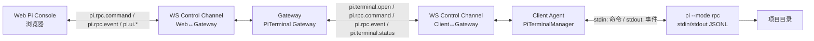

# 05b. Pi 交互式终端（Web Terminal）设计

## 背景与动机

`05-pi-agent-integration.md` 中的 `pi.run` 是**批处理任务**：底层 `pi --mode rpc` 单向驱动，
发 prompt→只读事件→`agent_end` 关进程，适合 Gateway/AI Agent 自动下发。它**不能**支撑
"用户在 Web 上像本地一样使用 Pi"这种交互式场景：

- 用户要能打字发 prompt、中途 steer（打断改方向）、abort。
- 要看到流式的文字、thinking、工具调用、bash 实时输出、文件 diff。
- 要能切模型、切 thinking、compact、new session、fork、clone、switch session。
- 扩展弹窗（`select`/`confirm`/`input`/`editor`）要能在浏览器里点。

Pi 官方提供了 `pi --mode rpc`：stdin/stdout 上的 JSONL 双向协议，命令 + 流式事件 +
扩展 UI 子协议。`pi.run` 已用其单向驱动用法（见 05）；本设计基于它的**双向用法**构建一个
**长生命周期、可重连、可审计**的 Web 终端通道。

## 与现有设计的关系

| 维度 | `pi.run`（05） | `pi.terminal`（本设计） |
|---|---|---|
| 底层模式 | `pi --mode rpc` 单向驱动 | `pi --mode rpc` 双向 attach |
| 生命周期 | 一次性任务，agent_end 后关进程 | 长会话，可挂起/重连 |
| 触发方 | Gateway/AI Agent 自动下发 | 用户在 Web 主动打开 |
| 通道 | Client→Gateway 单向事件流 | Web↔Gateway↔Client **双向** RPC 桥接 |
| 状态机 | task 状态机（created→…→succeeded） | PiTerminalSession 状态机（opened→attached→detached→…） |
| 结果 | task.result 汇总 | 持续流式，无最终 result；可导出 session |
| 计费/审计 | 任务级 | 会话级 + 采样事件流 |

二者共用 `PiAgentManager` 的 Pi 安装/Node 路径/settings 检测能力，但**进程托管逻辑独立**。

## 两种渲染形态（都支持，默认推荐 A）

### 形态 A：Web Pi Console（结构化渲染，默认）

Client 托管 `pi --mode rpc`，把 RPC 事件流桥接到 Web；Web 用自己的组件树渲染
一个"Pi 风格"的交互界面：

- 流式 markdown 正文（`text_delta` 增量拼接）
- 折叠的 thinking 块
- 工具调用卡片：bash 命令 + 实时 stdout（`tool_execution_update` 的 `partialResult` 直接替换显示）
- 文件编辑 diff 卡片、读文件卡片、搜索卡片等
- 输入框：prompt / `/slash` 命令 / steering / follow-up
- 顶栏：模型选择、thinking 级别、compact、abort ▾（下拉承载 `abort` / `abort_bash` / `abort_retry` 三档停止粒度，避免单一按钮无法区分"停整 turn"与"只停当前 bash"）
- 侧栏：会话列表（new / switch / fork / clone / rename）
- 扩展 UI 弹窗：`select`/`confirm`/`input`/`editor` 渲染成 Web 对话框

优点：结构化、低带宽、Windows 无 PTY 痛点、高风险可确认拦截、与平台 JSON 事件模型一致、
扩展 UI 天然可做。缺点：Web 端要实现一套 Pi 风格渲染（但这是所有 Web coding agent 都要做的）。

### 形态 B：Raw TUI Mirror（PTY + xterm.js，可选）

Client 在 PTY 里 spawn 真正的 `pi`（TUI 模式），把字节流透传到 Web 的 xterm.js，
所见即本地 Pi TUI。

优点：100% 还原本地体验、零渲染重写。缺点：Windows 需要 ConPTY、带宽高、
确认/扩展 UI 只能靠终端内交互、与平台结构化事件模型不一致。

**结论：A 为默认主通道，B 作为高级用户的可选"原像模式"，走同一 attach 通道、以 `render=raw` 区分（非独立 taskType）。**
本文后续协议设计以 A 为主，B 复用同一 attach 通道但负载为原始字节帧。

## 架构链路



关键边界不变：**Pi 不直接暴露公网，Client 不长期开公开 HTTP 端口**。所有双向流量都
复用已有的 Client↔Gateway WebSocket 控制通道，只新增消息类型；Web 侧另开一条
Gateway 的 attach WebSocket。

## 新增模块

### Gateway 侧

```text
server/
  pi-terminal-gateway      # 新增，与 pi-task-gateway 并列
    session-registry       # PiTerminalSession 登记：id/machineId/projectPath/piSessionFile/owner/status
    attach-mux             # Web attach WS 与 Client 控制通道之间的多路复用
    policy-gate            # 高风险工具确认拦截（见安全策略）
    audit-sampler          # 对 text_delta 等高频事件采样落审计
```

### Client 侧

```text
client/
  pi-terminal-manager      # 新增，与 pi-agent-manager 并列
    rpc-process-host       # spawn/持有 pi --mode rpc，管 stdin/stdout
    session-store          # 本地 PiSession 元数据、pid、piSessionFile
    reattach               # Client 重启后按 piSessionFile 恢复
    raw-pty-host           # 形态 B 的 PTY 透传（可选）
```

## PiTerminalSession 状态机

```text
opened ── attach ──▶ attaching ──▶ attached
                                   │
                              detach │ ◀── reattach
                                   ▼
                                detached
                                   │
                              close  │ (idle 超时 / 用户关闭 / 配额超限)
                                   ▼
                                 closing ──▶ closed
任意状态: error
```

- `opened`：Client 已 spawn pi --mode rpc，拿到 piSessionFile，尚未有 Web 接入。
- `attached`：至少一个 Web attach WS 连接中。
- `detached`：Web 全部断开，但 pi 进程仍存活（可配 idle 超时后自动 close）。
- `closed`：pi 进程已退出，资源回收；session 文件保留供后续 switch/fork。

## 通信协议

### 1) Web ↔ Gateway：HTTP

```text
POST   /api/pi/terminal                # 打开交互会话，返回 sessionId
GET    /api/pi/terminal                # 列出会话
GET    /api/pi/terminal/:id            # 会话状态
POST   /api/pi/terminal/:id/close      # 主动关闭
POST   /api/pi/terminal/:id/export     # 导出 session HTML/JSONL（走云盘或直接下载）
```

打开请求：

```json
{
  "machineId": "win-dev-01",
  "projectPath": "D:/any/dir/OptiMinder",
  "mode": "rpc",
  "render": "console",
  "sessionName": "fix-deps-20260620",
  "resumeFrom": null,
  "providerProfileId": "profile_001",
  "model": { "provider": "anthropic", "modelId": "claude-sonnet-4-20250514" },
  "constraints": {
    "toolMode": "full",
    "customTools": null,
    "appendSystemPrompt": null,
    "timeoutSeconds": 1800,
    "policyGate": {
      "enabled": true,
      "rules": ["rm -rf", "git push", "drop table"],
      "autoAction": "reject"
    },
    "idleTimeoutSeconds": 1800,
    "maxLifetimeSeconds": 86400
  },
  "environment": {
    "approveMode": "always"
  }
}
```

响应：

```json
{ "ok": true, "data": { "sessionId": "pisess_001", "attachUrl": "/ws/pi/terminal/pisess_001", "attachToken": "..." } }
```

### 2) Web ↔ Gateway：WebSocket attach

```text
/ws/pi/terminal/:id?token=...
```

双向 JSON 帧。

Web → Gateway（client frame）：

```json
{ "kind": "pi.rpc.command", "rpc": { "type": "prompt", "message": "列出 src 下所有文件" } }
```

```json
{ "kind": "pi.rpc.command", "rpc": { "type": "steer", "message": "先只看 .ts 文件" } }
```

```json
{ "kind": "pi.ui.response", "id": "uuid-1", "value": "Allow" }
```

```json
{ "kind": "pi.terminal.ping" }
```

Gateway → Web（server frame）：

```json
{ "kind": "pi.rpc.event", "event": { "type": "message_update", "message": {...}, "assistantMessageEvent": {"type":"text_delta","delta":"Hello"} } }
```

```json
{ "kind": "pi.ui.request", "id": "uuid-2", "method": "confirm", "title": "确认删除?", "message": "将删除 a.txt" }
```

```json
{ "kind": "pi.terminal.status", "status": "attached", "piState": { "model": {...}, "isStreaming": true, "messageCount": 12 } }
```

```json
{ "kind": "pi.terminal.closed", "reason": "idle_timeout" }
```

### 3) Gateway ↔ Client：复用控制通道，新增消息类型

Gateway → Client：

```json
{ "type": "pi.terminal.open", "sessionId": "pisess_001", "payload": { "projectPath": "...", "mode": "rpc", "sessionName": "...", "resumeFrom": null, "constraints": {...}, "env": {...} } }
```

```json
{ "type": "pi.terminal.close", "sessionId": "pisess_001", "reason": "user_close" }
```

```json
{ "type": "pi.rpc.command", "sessionId": "pisess_001", "rpc": { "type": "prompt", "message": "..." } }
```

Client → Gateway：

```json
{ "type": "pi.terminal.opened", "sessionId": "pisess_001", "piSessionFile": "C:/Users/xuzhe/.pi/agent/sessions/xxx.jsonl", "pid": 12345 }
```

```json
{ "type": "pi.rpc.event", "sessionId": "pisess_001", "event": { ...RPC 事件原文... } }
```

```json
{ "type": "pi.ui.request", "sessionId": "pisess_001", "id": "uuid-2", "method": "confirm", "title": "...", "message": "..." }
```

```json
{ "type": "pi.terminal.status", "sessionId": "pisess_001", "status": "attached", "piState": {...} }
```

```json
{ "type": "pi.terminal.closed", "sessionId": "pisess_001", "reason": "process_exit", "exitCode": 0 }
```

## RPC 命令/事件映射

Web 终端能力 ←→ Pi RPC 命令（直接透传，Client 不解释语义）：

| Web 动作 | RPC 命令 |
|---|---|
| 发 prompt | `prompt`（流式中需带 `streamingBehavior: "steer"\|"followUp"`） |
| 打断改方向 | `steer` |
| 排队后续 | `follow_up` |
| 停止 | `abort` / `abort_bash` / `abort_retry` |
| 跑一条 shell | `bash` |
| 切模型 | `set_model` / `cycle_model` / `get_available_models` |
| 切 thinking | `set_thinking_level` / `cycle_thinking_level` |
| 压缩上下文 | `compact` / `set_auto_compaction` |
| 新会话 | `new_session` |
| 切会话 | `switch_session` |
| 分叉/克隆 | `fork` / `clone` / `get_fork_messages` |
| 重命名 | `set_session_name` |
| 状态/消息 | `get_state` / `get_messages` / `get_session_stats` / `get_last_assistant_text` |
| 可用命令 | `get_commands` |
| 导出 | `export_html` |

Pi 事件 → Web 渲染：

| Pi 事件 | Web 渲染 |
|---|---|
| `message_update(text_delta)` | 增量拼接到当前 assistant 气泡 |
| `message_update(thinking_*)` | 折叠 thinking 块 |
| `message_update(toolcall_*)` | 工具调用卡片（参数增量） |
| `tool_execution_start/update/end` | bash 实时输出 / 文件 diff / 搜索结果卡片 |
| `turn_end` | 收口本轮，落 tool results |
| `queue_update` | 顶栏提示"已排队 N 条 steer/followUp" |
| `compaction_*` | 状态条提示"压缩中/完成，token X→Y" |
| `auto_retry_*` | 状态条提示重试 |
| `extension_error` | 错误 toast |
| `extension_ui_request` | Web 对话框（见下） |

## 扩展 UI 子协议（Web 弹窗）

Pi 扩展通过 `ctx.ui.select/confirm/input/editor` 请求用户交互。Client 把
`extension_ui_request` 透传给 Gateway→Web，Web 渲染对应弹窗，用户操作后回
`pi.ui.response`：

- `select` → 下拉单选对话框 → `{value}` 或 `cancelled:true`
- `confirm` → 确认对话框 → `{confirmed:true/false}` 或 `cancelled:true`
- `input` → 单行输入框 → `{value}` 或 `cancelled:true`
- `editor` → 多行编辑器 → `{value}` 或 `cancelled:true`

Fire-and-forget 方法（`notify`/`setStatus`/`setWidget`/`setTitle`/`set_editor_text`）
直接渲染成 Web 的 toast / 状态栏 / 侧栏 widget / 标签页标题 / 输入框预填，无需回包。

`timeout` 由 Pi 侧自管，Web 不需要计超时。

## 安全策略（在 `pi.run` 已有策略上叠加）

1. **路径绑定**：`pi --mode rpc` 的 cwd 由 projectPath 决定（spawn 的 cwd 选项，**不是 --cwd flag**），不受 allowedPaths 限制。
2. **确认拦截（policy-gate）**：
   - 方式一（推荐）：Client 订阅 `tool_execution_start`，对命中 `policyGate.rules` 的工具（如 `bash` 含 `rm -rf` / `git push` / 库写操作）**暂停透传**，先发 `pi.ui.request(method=confirm)` 让 Web 用户确认；用户拒绝则回 `abort` 该 toolcall。
   - 方式二：高风险工具走扩展 confirm（若 Pi 扩展已内置确认钩子），Gateway 仅审计。
   - 二者都把"命令/文件变更/确认结果"写审计。
3. **配额**：每机器最大并发 PiTerminalSession 数、单会话最大 lifetime、detached 空闲超时自动 close。
4. **输出限流**：`tool_execution_update` 的 partialResult 在 Client 侧做窗口限流（如每 toolCall 每 200ms 至多一帧），避免 bash `yes` 等刷屏打爆链路。
5. **审计采样**：`text_delta`/`tool_execution_update` 等高频事件**采样**落库（首帧 + 末帧 + 每 N 帧一帧 + 全量写会话 JSONL 文件）；`turn_end`/`tool_execution_end`/`pi.ui.*`/`pi.terminal.*` **全量**落审计。
6. **会话归属**：attachToken 与 sessionId 绑定、短期有效；Web WS 鉴权同平台 token。
7. **不可绕过**：Web 不能直接给 Client 发任意 shell，只能发 Pi RPC 命令；raw shell 走独立的 `command.run` 任务，另受命令策略约束。

## 会话持久化与重连

- `pi --mode rpc` 带 `--session-dir <client 本地 sessions 目录>`，每个会话一个 JSONL 文件。
- PiTerminalSession 登记表为 Gateway DB 的 `pi_sessions` 表（见 08，`task_id=NULL` 区分交互会话；批处理 `pi.run` 会话 `task_id` 非空）。交互会话相关字段：id / machineId / projectPath / piSessionFile / ownerToken / status(opened/attaching/attached/detached/closing/closed/error) / render(console/raw) / lastAttachAt / exitCode / closeReason。

- **Detach 不杀进程**：Web 关闭 attach WS 仅置 `detached`，pi 进程继续；到 `idleTimeoutSeconds` 才 close。
- **Reattach**：用户重新打开同一 sessionId，Gateway 校验归属后直接桥接，Web 先收到一段 `pi.terminal.status` + `get_state`/`get_messages` 回填历史。
- **Client 重启**：PiTerminalManager 扫本地 session-store，对仍可恢复的会话重新 `pi --mode rpc` + `switch_session <piSessionFile>`，状态置 `detached` 等用户重连；不可恢复的置 `closed`。
- **跨机器**：不支持。PiTerminalSession 绑定 machineId，机器离线则会话不可用。

## 会话清理策略

Pi 会话 JSONL 文件在 Client 本地会持续增长，必须有清理策略：

- **配额**：每机器最大保留 N 个 closed 会话文件、总大小上限 X MB（可配，默认 N=50 / X=512MB）。
- **清理时机**：会话 `closed` 后按 LRU 清理超配文件；Client 启动时做一次扫描清理。
- **保留优先级**：最近 `closed_at` 优先保留；被 `pi_sessions` 表引用且未归档的优先保留。
- **归档**：超配前可选 `export_html` / 导出 JSONL 到 StorageProvider（走 `file.export_to_cloud`），归档后删本地文件、DB 保留元数据 + 归档链接。
- **DB 元数据**：`pi_sessions` 表记录 `pi_session_file` / `archived_url` / `closed_at`，文件清理不影响 DB 记录与审计。
- **detached 不清理**：只有 `closed` 状态的会话文件才纳入清理。

## 形态 B（Raw TUI Mirror）的接入

同一套 attach 通道，区别：

- 打开时 `render: "raw"`，Client 用 `raw-pty-host` 在 ConPTY/PTY 内 spawn `pi`（不加 `--mode rpc`）。
- 帧类型改为 `pi.raw.input`（Web→Client，键盘字节）/ `pi.raw.output`（Client→Web，终端字节）。
- Web 用 xterm.js 渲染。
- 确认/扩展 UI 由 Pi TUI 自己在终端内处理；policy-gate 退化为"只审计、不拦截"（或拒绝 raw 模式下命中 `policyGate.rules` 的会话打开）。
- Windows 需要 ConPTY；不支持 ConPTY 的环境直接回退为不可用。

## 与 `pi.run` 的协同

- 同一项目可同时有一个 `pi.terminal`（用户手动）和多个 `pi.run`（自动下发），但建议 Machine Policy 限制同项目并发数。
- `pi.terminal` 里用户可 `/skill:*`、`/template`，扩展命令在 RPC 模式下立即执行（见 rpc.md）。
- 用户在 Web 终端里定位问题后，可一键"转为 pi.run 任务"：把当前 session 的最后一条 user prompt + 上下文摘要封装成 PiTask 下发，进入批处理审计流。

## 落地拆解（建议顺序）

1. Client：`PiTerminalManager` + `rpc-process-host`，本地能 spawn `pi --mode rpc` 并双向 pipe。先写一个 Node 小脚本自测 prompt/abort/tool 事件。
2. Gateway↔Client：新增 `pi.terminal.*` / `pi.rpc.*` 控制通道消息，多路复用到一个 PiTerminalSession。
3. Gateway↔Web：`/api/pi/terminal*` HTTP + `/ws/pi/terminal/:id` attach WS。
4. Web Console：先做最小可用——prompt 输入 + 流式 text + bash 工具卡 + abort + 模型切换。
5. 扩展 UI 弹窗 + 会话侧栏（new/switch/fork/clone）+ 确认拦截 policy-gate。
6. 持久化、重连、审计采样、配额、导出。
7. （可选）形态 B Raw TUI Mirror。

## 风险与取舍

- **Web 渲染工作量**：形态 A 要实现一套 Pi 风格渲染层，是主要工作量；可参考 Pi TUI 的信息层级，不必逐像素复刻。
- **高频事件带宽**：bash 实时输出在弱网下可能卡顿；靠 Client 侧窗口限流 + Web 侧增量替换缓解。
- **确认与 Pi 内置钩子的边界**：若 Pi 扩展自己弹 confirm，与 Gateway policy-gate 可能重复弹窗；约定"policy-gate 命中 policyGate.rules 时以 policy-gate 为准，Pi 内置 confirm 透传但标注来源"。
- **Windows PTY**：形态 B 在 Windows 依赖 ConPTY，老版本 Windows 可能不稳定；形态 A 无此问题，是选 A 为默认的又一原因。
- **长会话成本**：长会话持续消耗模型 token；靠 `get_session_stats` 在 Web 顶栏展示 token/费用，并在 `maxLifetimeSeconds` 到期前提示用户。
