# 09. 状态机设计

## Task 状态机

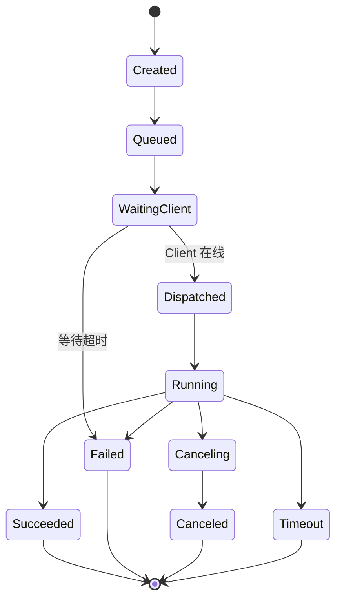

终态四个：`succeeded` / `failed` / `canceled` / `timeout`；图中 PascalCase 仅为 Mermaid 标签，DB/API 使用小写枚举。Timeout 不再转 failed，是独立终态。

### 审批子状态（独立字段，不进入 status）

高风险操作（命中 `requireApprovalFor` / Runbook `approve()` / `cmd({approve:true})`）**不改变 Task 的 `status`**（保持 `running`），而是置 `tasks.approval_status = waiting_confirm`，并创建一条 `Approval(status=waiting)`。用户在 Web/CLI/SDK 决策后：确认通过→Approval=approved，Task `approval_status=approved`，执行继续；拒绝→Approval=rejected，Task `approval_status=rejected`；确认超时→Approval=timeout，Task `approval_status=timeout`，后两者转 `status=failed`。确认流程图见 10。

`approval_status` 取值：`not_required` / `waiting_confirm` / `approved` / `rejected` / `timeout`（见 08 tasks 表）。对个人系统语义为“等待使用者确认”，UI 文案统一用“待确认”（见 11/17）。

## RunbookRun 状态机

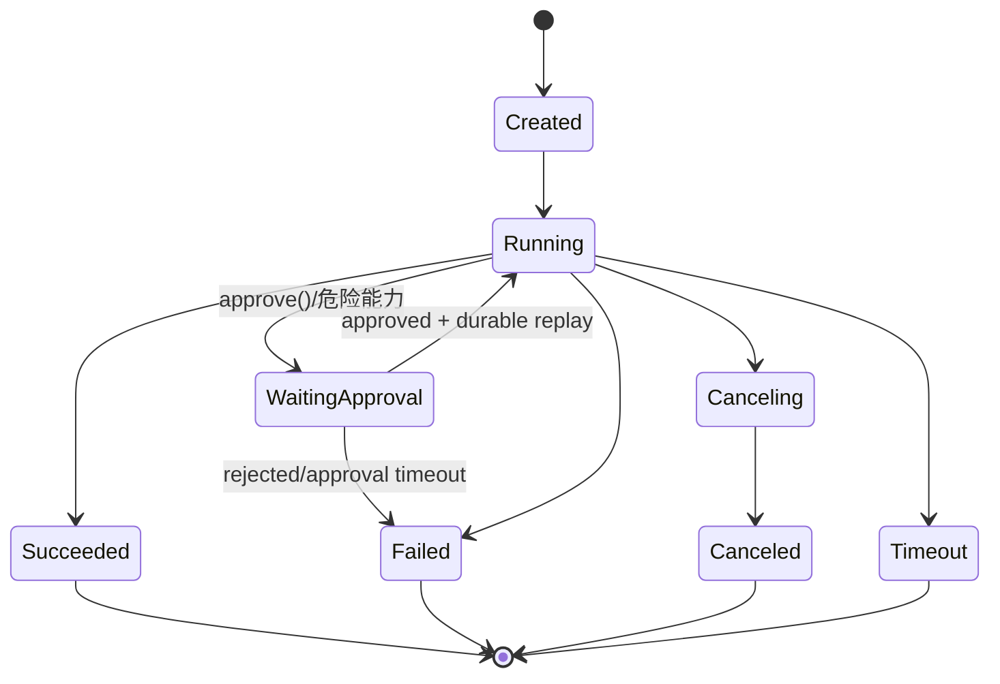

RunbookRun 是跨机器编排实例，不等同于单个 Task。能力调用会生成子 Task / TransferJob / Approval；RunbookRun 通过 trace 聚合这些子步骤。

## Approval 状态机

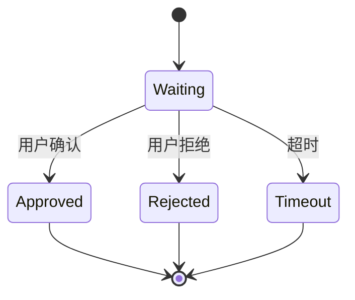

Approval 是一等实体，来源包括 `runbook_gate` / `command_option` / `policy_gate`。RunbookRun 等待审批时状态为 `waiting_approval`；Task 命中审批时 Task.status 仍保持 `running`，由 `approval_status` 跟踪子状态。

## Client 连接状态机

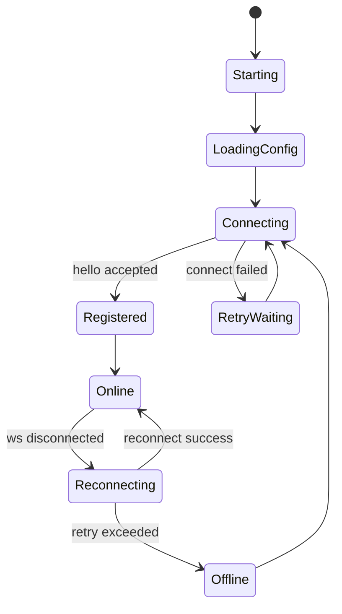

重连后必须 reconcile（见 10）：

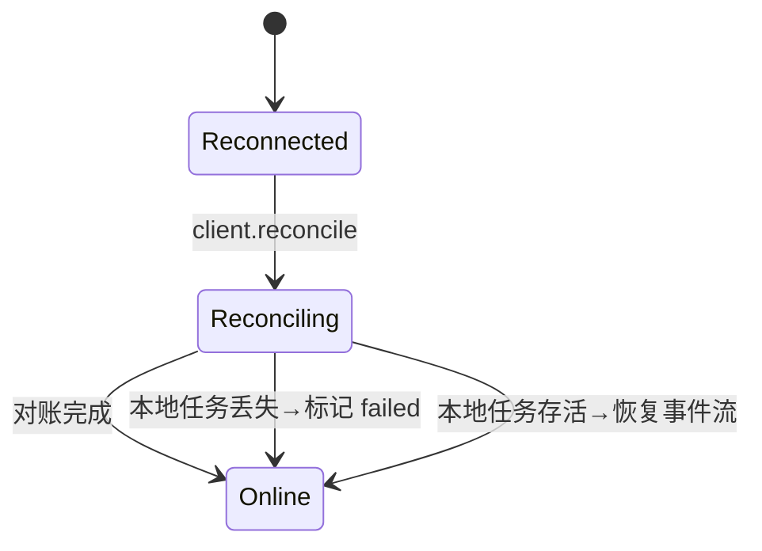

## Client 自更新状态机

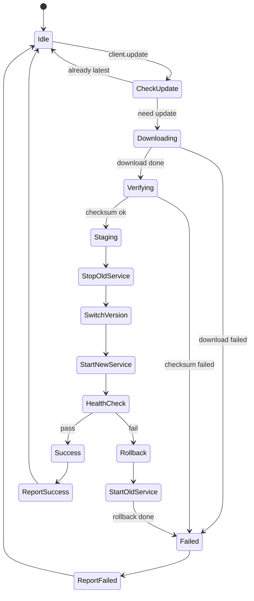

## Server 自更新状态机

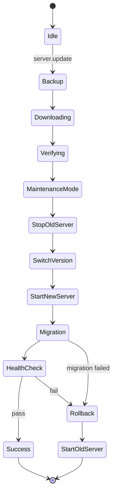

## Pi Task 状态机（pi.run，rpc 单向驱动）

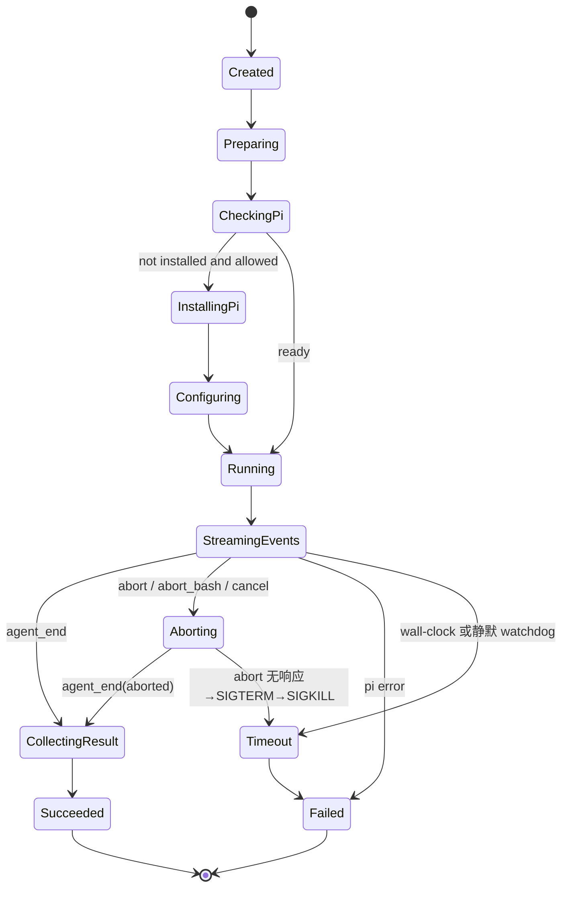

与 05 一致：收到 `agent_end` 后主动关进程；卡住先 `abort` 优雅停，无响应再 SIGTERM→SIGKILL，结果带 `partial=true`。

## Pi Terminal Session 状态机（pi.terminal，见 05b）

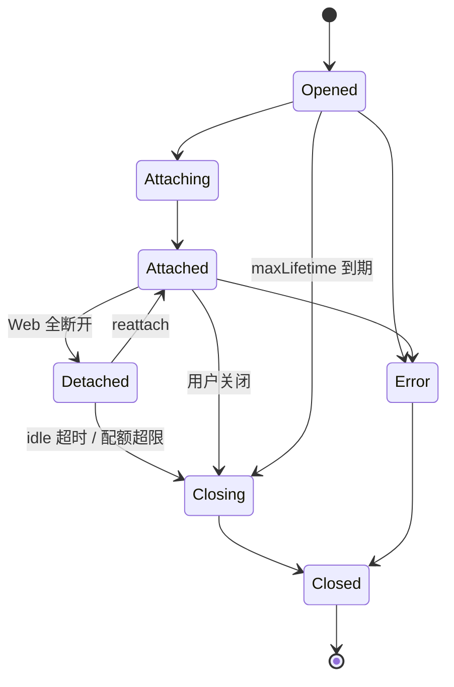

## FRP Mapping 状态机

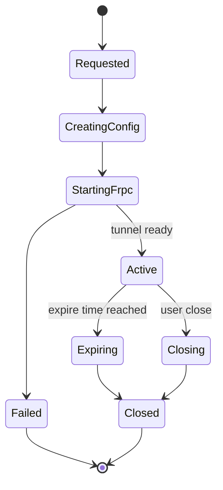

## TransferJob 状态机

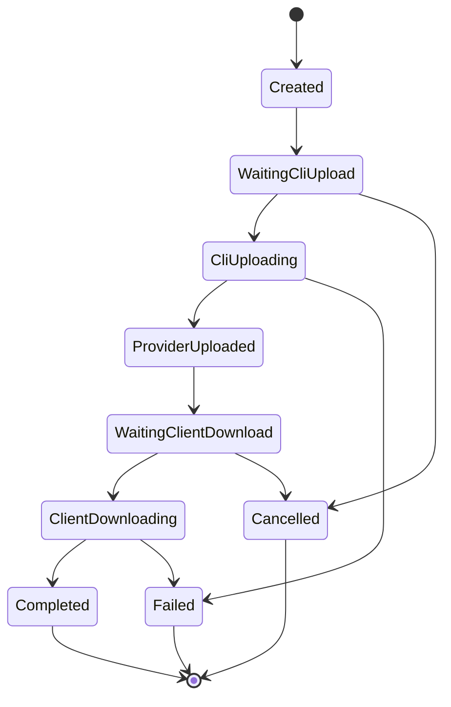

上传/下载 URL 过期不改变状态，调用 refresh-upload-url / refresh-download-url 后继续。SDK Node helper 用 checkpoint 做分片级断点续传。

## SyncJob 状态机

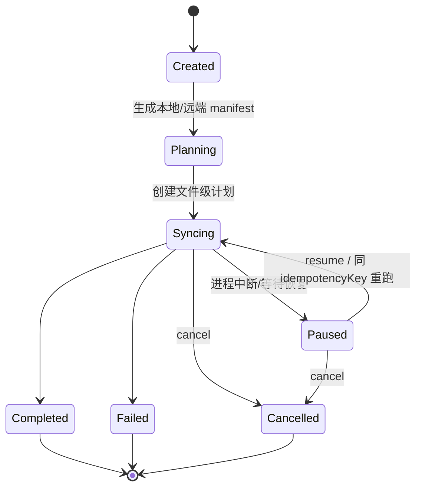

SyncJob 是目录级同步实例，下面挂多个 TransferJob。默认不删除多余文件，不做块级 diff；冲突默认 skip。

## Todo 状态机（见 20）

### 叶子 Todo

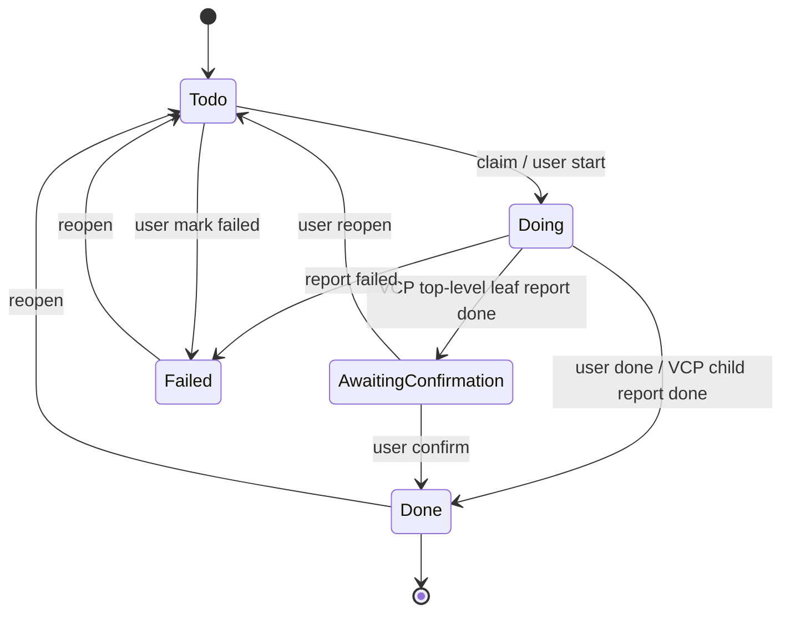

规则：

- `ready` 只在 `status=todo` 的叶子 Todo 上有效；`doing` 时冻结。
- VCP report done 到顶层 leaf：进入 `awaiting_confirmation`。
- VCP report done 到子任务 leaf：子任务直接 `done`，父 Todo 负责最终确认。
- 用户自己完成 leaf 可直接 `done`。

### 父 Todo

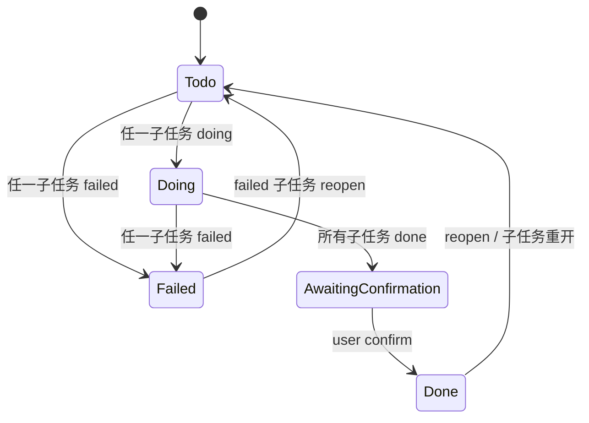

父 Todo 状态由服务端在子任务变更事务中维护；父 Todo 不可 claim，且存在 failed 子任务时不可 confirm。
