# 10. 核心流程 Mermaid

## SDK 初始化与能力发现

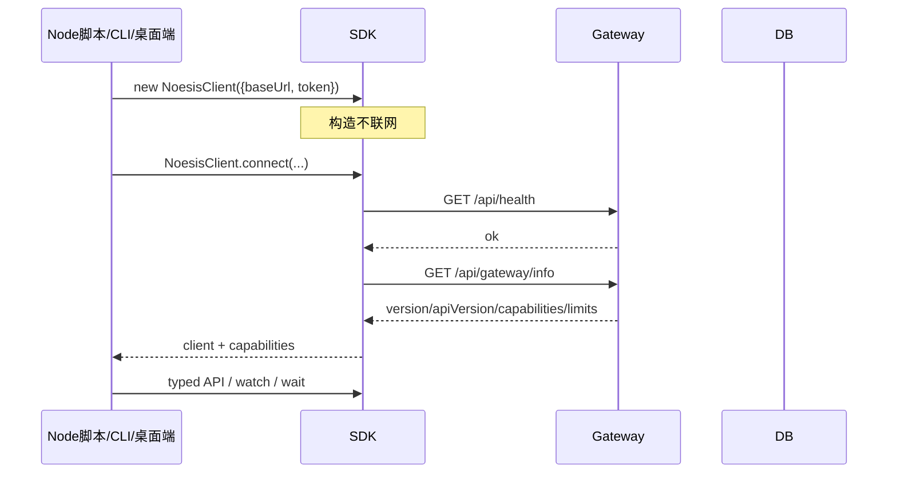

## SDK 事件流 watch / wait

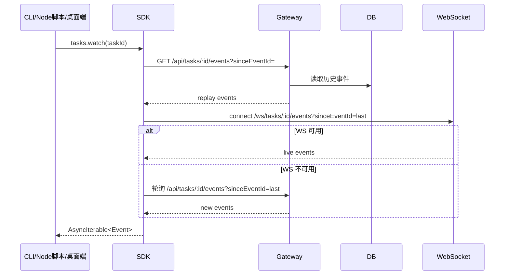

## 命令执行

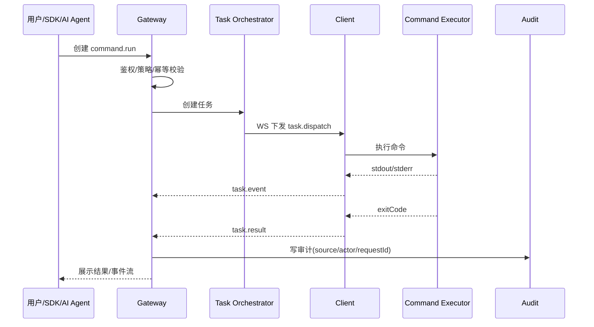

## Runbook 执行与审批恢复

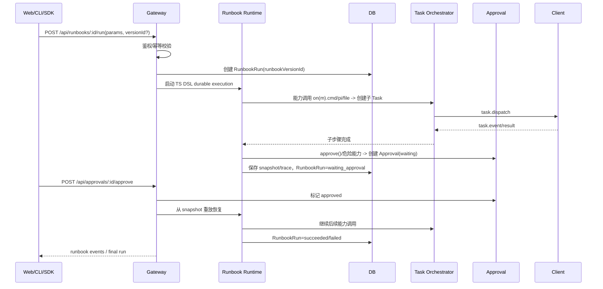

## VCP 领取 Todo 并回写结果

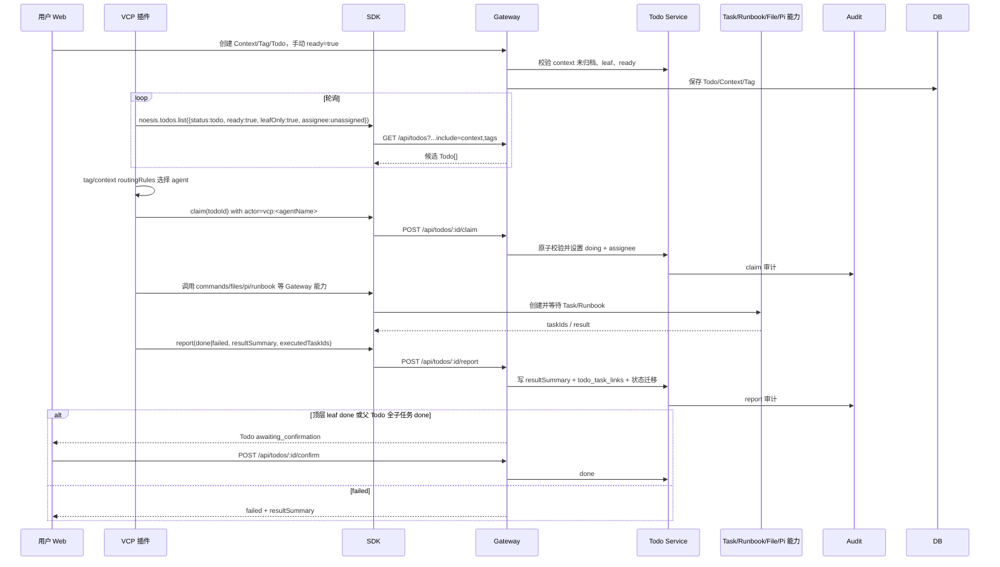

## 大文件导入：StorageProvider 到目标机器

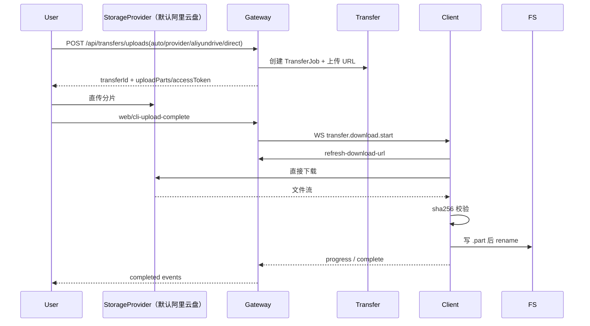

## SDK 断点续传上传

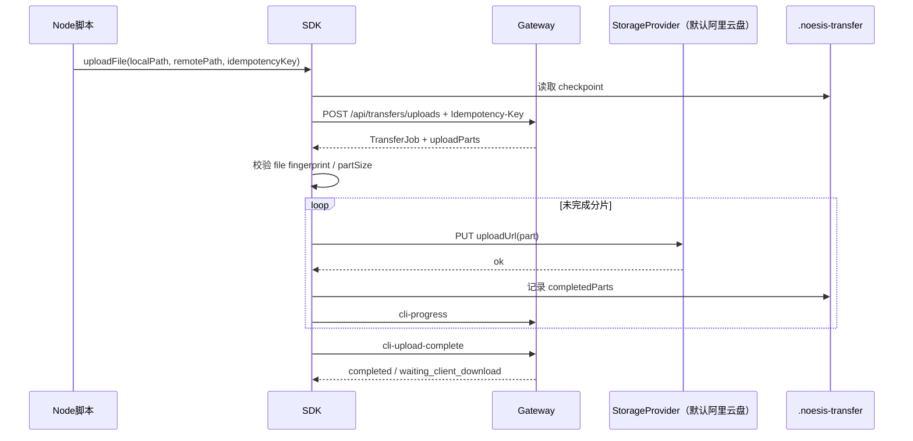

## Sync 目录同步上传

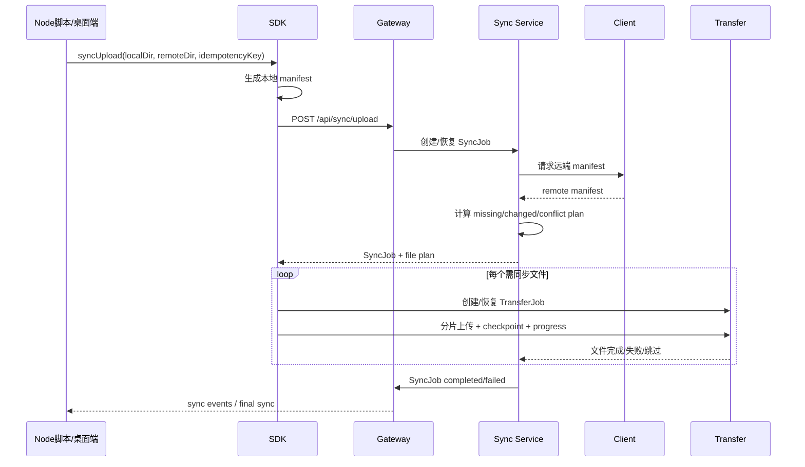

## Sync 目录同步下载

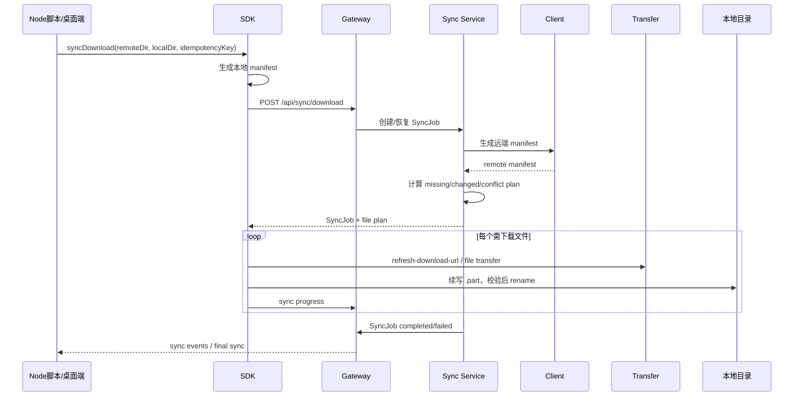

## Pi Agent 任务

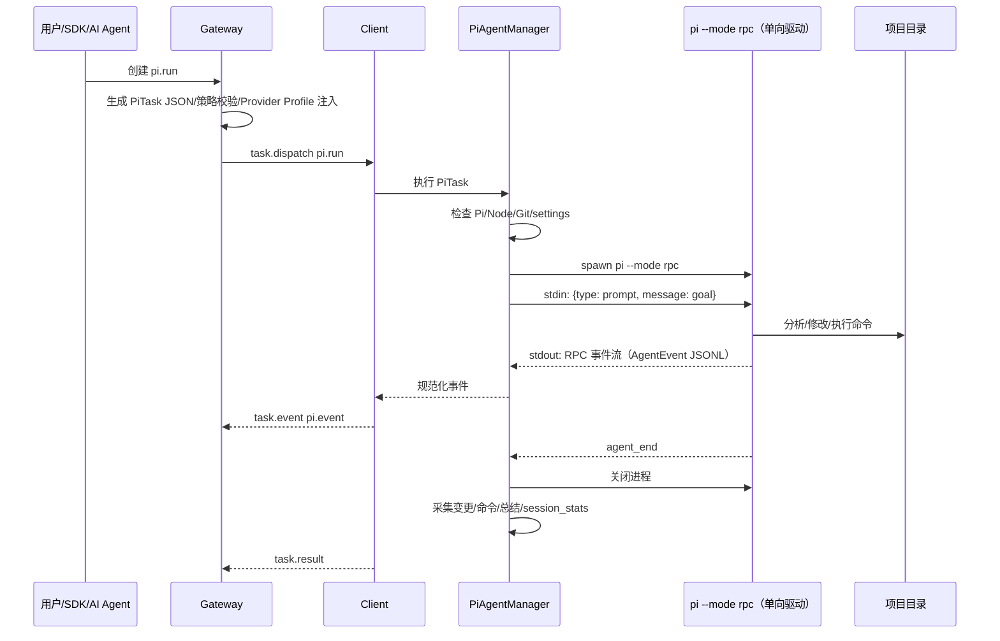

## Pi Terminal Attach

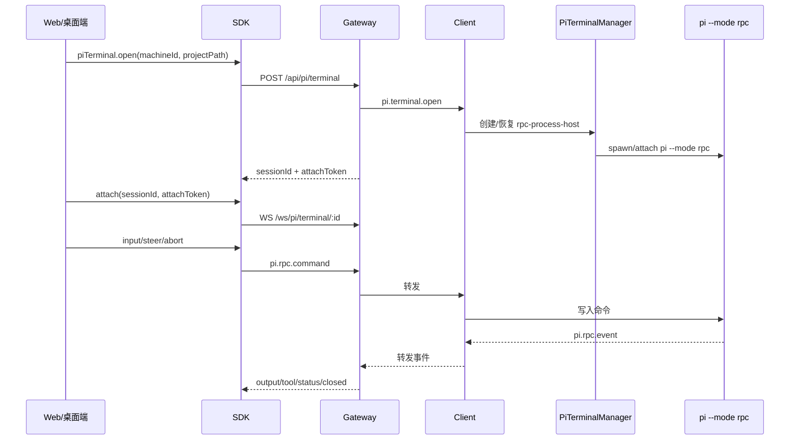

## 高风险确认

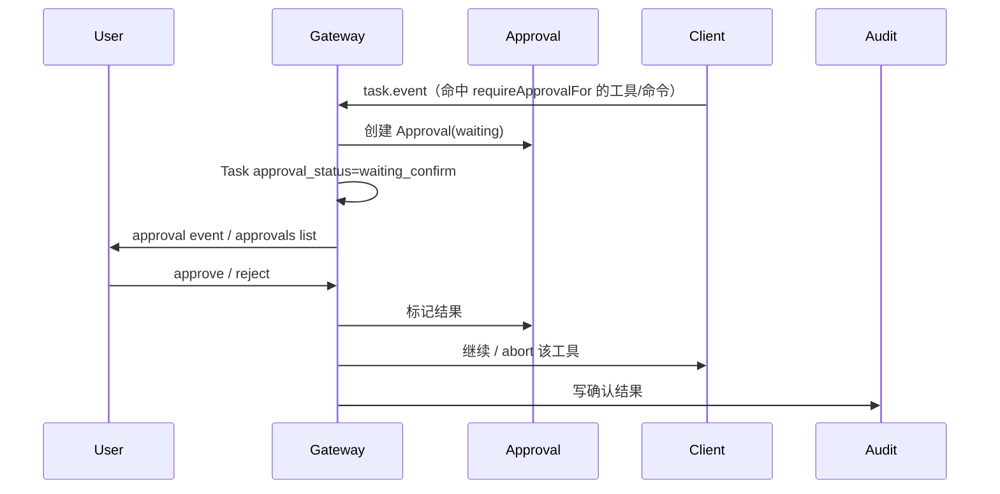

## Client 重连 Reconcile

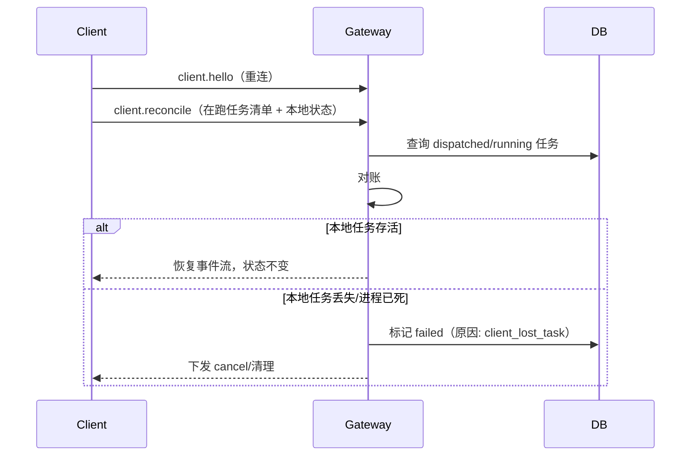

## Client 一键安装

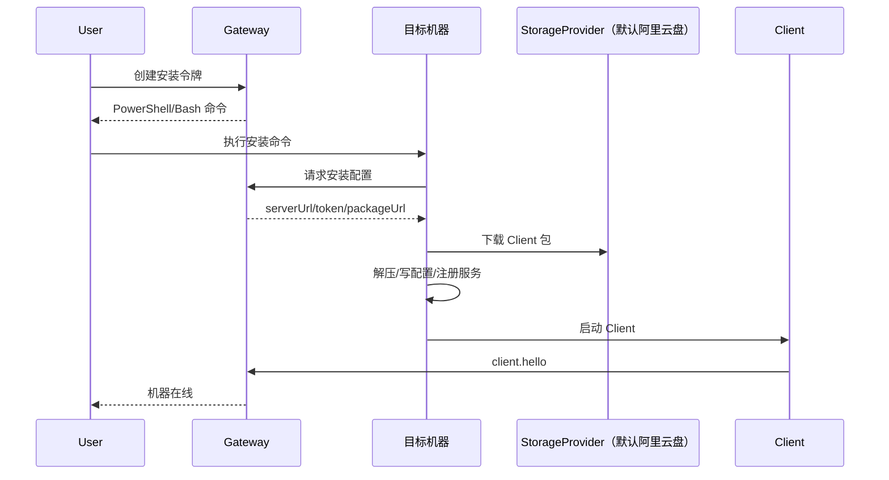

## 一键更新所有 Client

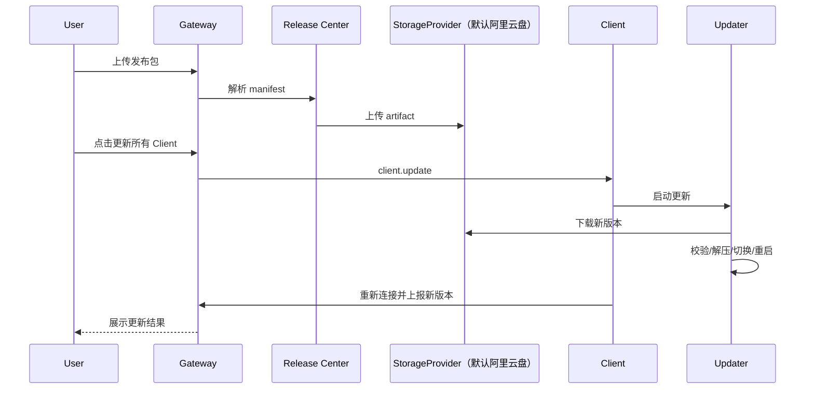

## FRP 临时映射

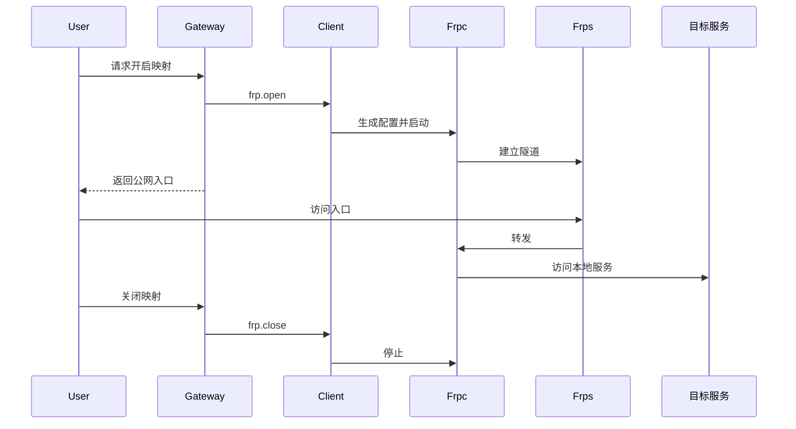
