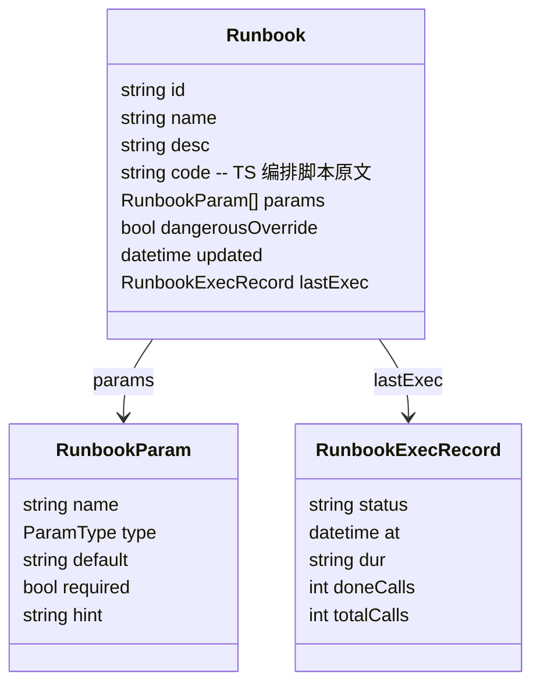

# 17. Runbook 流程编排（TS 即 DSL）

## 设计理念

> 单个脚本 / 单个 Pi 任务没有意义，**跨机器的流程编排**才有意义。
> 而编排最自然的表达方式，就是**直接写代码**。

Runbook 经历过两个阶段：

1. **单模板阶段（已废弃）**：Runbook 是「一个模板」——一段 shell 步骤或一个 Pi 一次性任务，下发到一台机器。语义薄弱，和终端历史 / Pi 工作台直接发任务重叠，无跨机器能力。
2. **声明式节点图阶段（已废弃）**：Runbook 是 `nodes[] + dependsOn + kind` 的节点图，能表达串行/并行/汇聚。但模型要为每种结构设计字段（依赖、失败策略、确认门…），扩展能力得加节点 kind 枚举 + UI 分支，且撑不住分支/循环/数据传递。
3. **TS 即 DSL 阶段（当前）**：Runbook 是**一段 TypeScript 脚本**，`import` 一组带类型的能力函数来组织跨机器流程。代码即编排，能力函数即步骤单元。

为什么选 TS 即 DSL：

| | 声明式节点图 | TS 即 DSL |
|---|---|---|
| 串行/并行/汇聚 | 设计 dependsOn schema | `await` / `Promise.all` 天然表达 |
| 分支/循环/数据传递 | 模型撑不住 | `if`/`for`/变量传递原生 |
| 失败策略 | `onFail` 字段 | `try/catch`，更自然 |
| 扩展能力 | 加节点 kind 枚举 + UI 分支 | 加一个能力函数，完事 |
| 类型安全 | 无 | 能力函数签名类型检查 |
| 可观测映射 | 节点 → Task | 能力调用 → Task，一一对应 |

代价是 UI 从「漂亮的 DAG 节点图」变成「代码 + 执行 trace」——这正是 Windmill / Inngest / Temporal 这类编排系统的成熟做法：代码是源头，trace 是观测。

## 能力函数（DSL 核心）

系统的所有能力被封装成一组**带类型的能力函数**，注入到编排脚本运行时。能力分**两层**，都在 `RunbookDsl` 上：

| 层 | 作用域 | 接口 | 能力 |
|---|---|---|---|
| 机器绑机能力 | 作用于指定机器 | `on(machine)` → `MachineDsl` | `cmd` / `pi` / `file.{read,write,move,delete}` |
| 全局能力 | 不绑机，作用于全局资源 | `RunbookDsl.cloud/.todo/.machines` | 云盘跨机搬运 / 待办 / 动态选机 |

**为什么分两层**：`cmd/pi/file` 是「在某台机器上做某事」，必须绑机；但 `cloud`（云盘是全局资源）、`todo`（待办不属某台机器）、`machines`（查机器列表）不属任何单机——塞进 `MachineDsl` 会让 `build.todo(...)` 语义错位（todo 不属于 build 机）。全局能力挂在 `RunbookDsl` 顶层，和 `on()` 平行，才是正确归属。

核心设计是 **`on(machine)` 绑定机器**：一条流主要在几台机器上跑，绑定一次后后续调用不再重复传 machine，变量名自带语义（`build`/`db`/`app`），读起来就是「在 build 机上跑命令」。这避免了每行写裸字符串 machine id（啰嗦且 typo 不报错）。

```ts
// 机器绑机能力：on(machine) 返回，所有调用作用于这台机器
interface MachineDsl {
  cmd(command: string, opts?: { approve?: boolean; timeout?: number }): Promise<CmdResult>;
  pi(prompt: string, opts?: { approve?: boolean; timeout?: number }): Promise<PiResult>;
  file: {
    read(path: string): Promise<string>;
    write(path: string, content: string): Promise<void>;
    move(from: string, to: string): Promise<void>;
    delete(path: string): Promise<void>;
  };
  browser: {
    run(instruction: string, opts?: { mode?: "macroFirst" | "agent" | "observeOnly" }): Promise<AutomationResult>;
    runMacro(macroId: string, opts: { version: number; inputs?: Record<string, unknown> }): Promise<AutomationResult>;
  };
  computer: {
    run(instruction: string, opts?: { mode?: "macroFirst" | "agent" | "observeOnly" }): Promise<AutomationResult>;
    runMacro(macroId: string, opts: { version: number; inputs?: Record<string, unknown> }): Promise<AutomationResult>;
  };
}

// 全局能力（不绑机，作用于全局资源）
interface CloudDsl {
  copyAcross(from: {machine:string; path:string}, to: {machine:string; dir:string}): Promise<TransferResult>; // 经 StorageProvider 中转跨机搬文件
  backup(machine: string, path: string): Promise<TransferResult>;
}
interface TodoDsl {
  create(input: {
    title: string;
    description?: string;
    due?: string;
    priority?: number;
    tagIds?: string[];
    contextId?: string;
    parentId?: string;
    ready?: boolean;
    assignee?: "me" | null;
  }): Promise<TodoItem>;
  list(filter?: TodoListFilter): Promise<TodoItem[]>;
}
interface MachinesDsl {
  list(filter?: { tag?: string; online?: boolean }): Promise<MachineRef[]>; // 动态选机，不硬编码 id
}

interface RunbookDsl {
  on(machine: string): MachineDsl;     // 机器绑机能力
  approve(message: string): Promise<void>;  // 人工确认门，挂起执行
  log(message: string): void;               // 记录可观测事件
  sleep(ms: number): Promise<void>;
  cloud: CloudDsl;      // 全局：云盘跨机搬运
  todo: TodoDsl;        // 全局：待办
  machines: MachinesDsl; // 全局：动态选机
}
```

每次能力调用是**一个可观测、受策略约束、可挂起的步骤单元**，对应一个 Task。脚本只是把这些调用粘起来。

**扩展性是这个模型的最大优势**：加新能力只需往对应层接口加方法——机器能力加到 `MachineDsl`，全局能力加到 `RunbookDsl` 上的命名空间（`cloud.*`/`todo.*`），编排脚本立即可用，**模型层零改动**。能力集是开放的，编排表达力随系统成长而成长。接口声明只是第一步；从接口到真实可用的完整扩展路径（运行时挂载/注册发现/策略/Task协议/UI元数据）见[能力扩展机制](#能力扩展机制加新功能模块怎么做)。

### 能力清单速查

一栏查阅所有能力函数的签名、返回值、对应 Task type：

| 能力 | 层 | 签名 | 返回 | 对应 Task type |
|---|---|---|---|---|
| `cmd` | 机器 | `on(m).cmd(command, { approve?, timeout? })` | `CmdResult` | `command.run` |
| `pi` | 机器 | `on(m).pi(prompt, { approve?, timeout? })` | `PiResult` | `pi.run` |
| `file.read` | 机器 | `on(m).file.read(path)` | `string` | `file.read` |
| `file.write` | 机器 | `on(m).file.write(path, content)` | `void` | `file.write` |
| `file.move` | 机器 | `on(m).file.move(from, to)` | `void` | `file.move` |
| `file.delete` | 机器 | `on(m).file.delete(path)` | `void` | `file.delete` |
| `browser.run` | 机器 | `on(m).browser.run(instruction, opts?)` | `AutomationResult` | `browser.run` |
| `browser.runMacro` | 机器 | `on(m).browser.runMacro(macroId, {version, inputs?})` | `AutomationResult` | `browser.macro.run` |
| `computer.run` | 机器 | `on(m).computer.run(instruction, opts?)` | `AutomationResult` | `computer.run` |
| `computer.runMacro` | 机器 | `on(m).computer.runMacro(macroId, {version, inputs?})` | `AutomationResult` | `computer.macro.run` |
| `cloud.copyAcross` | 全局 | `cloud.copyAcross(from, to)` | `TransferResult` | `cloud.transfer` |
| `cloud.backup` | 全局 | `cloud.backup(machine, path)` | `TransferResult` | `cloud.transfer` |
| `todo.create` | 全局 | `todo.create({ title, description?, tagIds?, contextId?, ready? })` | `TodoItem` | `todo.create` |
| `todo.list` | 全局 | `todo.list({ status?, ready?, tagId?, contextId?, leafOnly? })` | `TodoItem[]` | 只读，无 Task |
| `machines.list` | 全局 | `machines.list({ tag?, online? })` | `MachineRef[]` | 只读，无 Task |
| `approve` | 控制流 | `approve(message)` | `void` | `waiting_confirm`（挂起） |
| `log` | 控制流 | `log(message)` | `void` | 仅可观测事件 |
| `sleep` | 控制流 | `sleep(ms)` | `void` | 仅定时事件 |

机器能力绑定在 `on(machine)` 返回的 `MachineDsl` 上，全局能力直接挂在 `RunbookDsl` 顶层。只读查询（`todo.list`/`machines.list`）不产生副作用 Task，仅写可观测事件供 trace 展示。

## 编排脚本示例

```ts
import { defineRunbook } from "../runbookDsl";

export default defineRunbook({
  name: "全栈发布流水线",
  desc: "构建机拉代码构建 → 打包 → 下发到 DB 机停服/替换/启服 → Pi 验证健康",
  params: [
    { name: "项目目录", type: "path", required: true, hint: "构建机项目根" },
    { name: "服务名", type: "string", required: true, hint: "systemd 服务名" },
  ],
  dangerousOverride: true,
}, async ({ 项目目录, 服务名 }, { on, approve, log }) => {
  const build = on("win-dev-01");   // 绑定构建机，变量名带语义
  const db = on("linux-db-02");      // 绑定数据库机

  // 1. 构建机：拉码 → 构建 → 打包（串行 = 顺序 await）
  await build.cmd(`cd ${项目目录} && git pull --ff-only && npm run build`);
  await build.cmd("tar -czf dist.tar.gz dist/");

  // 2. 人工确认门（挂起，等用户确认）
  await approve(`准备停 ${服务名} 并替换产物，确认继续？`);

  // 3. DB 机：停服 → 替换 → 启服
  await db.cmd(`systemctl stop ${服务名}`);
  await db.cmd(`scp win-dev-01:dist.tar.gz /opt/app/ && tar -xzf dist.tar.gz && systemctl start ${服务名}`);

  // 4. Pi 健康验证（失败继续 = try/catch，给回滚建议）
  try {
    await db.pi(`服务 ${服务名} 刚重启，curl 健康检查确认 200，异常给回滚建议。`);
  } catch (e) {
    log(`健康验证失败：${e}，请人工介入`);
  }
});
```

读起来就是流程本身：在 build 机上 cmd、在 db 机上 cmd、approve 挂起、db 上 pi 验证。语义变量名比裸字符串 `"linux-db-02"` 可读得多。

### 两层能力示例（机器能力 + 全局能力）

r7「DB 机组配置备份与同步」同时用了两层能力，展示怎么操作机器文件、怎么调全局能力：

```ts
import { defineRunbook } from "../runbookDsl";

export default defineRunbook(
  { name: "DB 机组配置备份与同步", /* ... */ },
  async ({ 配置路径, 新配置内容 }, { on, approve, log, cloud, machines, todo }) => {
    // 全局能力：动态选机——不硬编码 id，按标签+在线状态筛选
    const dbs = await machines.list({ tag: "db", online: true });
    if (dbs.length === 0) { log("没有在线的 db 机组"); return; }

    // 机器能力：并行读每台配置（Promise.all = 并行）
    const configs = await Promise.all(
      dbs.map((m) => on(m.id).file.read(配置路径)),
    );

    // 全局能力：经 StorageProvider 中转，把每台配置汇聚到备份机
    for (const m of dbs) {
      await cloud.copyAcross(
        { machine: m.id, path: 配置路径 },
        { machine: "linux-db-02", dir: `/opt/backup/cfg-${m.id}` },
      );
    }

    await approve(`即将用新配置覆盖 ${dbs.length} 台 db，确认？`);

    // 机器能力：下发新配置 + 重载
    for (const m of dbs) {
      const target = on(m.id);
      await target.file.write(配置路径, 新配置内容);
      await target.cmd("systemctl reload mysql");
    }

    // 全局能力：把后续人工核查记成待办，运维不丢
    await todo.create({
      title: "核查 db 机组配置同步后业务指标",
      description: "检查配置同步后 30 分钟业务指标是否恢复正常。",
      due: "今日",
      contextId: "ctx_db_ops",
      ready: true,
    });
  },
);
```

两个清晰路子：`on(m).file.*` / `on(m).cmd()` 拿机器能力（作用于 m 这台机），`cloud.*` / `machines.*` / `todo.*` 拿全局能力（不绑机）。`machines.list` 还让脚本不硬编码 machine id——按标签动态选机，机器上下线无需改脚本。

## 控制流与错误处理语义

DSL 的编排表达力来自 TS 原生控制流，不靠模型层字段。这是「直观易写」的根源——全是 TS 程序员的本能，零额外学习成本。

| 语义 | 写法 | 含义 |
|---|---|---|
| 串行 | 顺序 `await` | 前一步完成才下一步 |
| 并行 | `Promise.all([...])` | 多个能力调用同时跑，全部成功才继续 |
| 并行·任一失败不阻断 | `Promise.allSettled([...])` | 等全部结束（无论成败），适合「尽力打包两台，谁失败都继续汇聚」 |
| 汇聚点 | `Promise.all` / `allSettled` 后的下一行 | 多个并行分支在这里收口 |
| 数据传递 | 普通变量 | 能力调用有返回值（`CmdResult`/`PiResult`），赋给变量喂给后续调用，如 `diag.summary` → 归因 prompt。不需模型层数据流字段 |
| 失败即止 | 不 `catch` | 能力调用抛错，整条 Runbook 中止（关键路径：构建失败就不该部署） |
| 机器离线 | 能力调用抛 `MACHINE_OFFLINE` | 目标机器离线或执行中断连时，该能力 Task 失败并抛错；是否等待重连/跳过/中止由脚本 `try/catch` 决定，默认不 catch 即中止 |
| 失败继续 | `try/catch` | 跳过该步继续流（非关键：健康验证失败给回滚建议，不阻断主流程） |
| 人工确认门 | `approve(msg)` | 断点挂起：序列化执行状态后运行时退出，零占用；确认信号到来后重放恢复（见[运行时契约](#运行时契约真实实现需做)）。拒绝则抛错，外层可 `catch` 决定是否中止 |

对照旧节点图的 `onFail: "abort"|"continue"` 字段 + `dependsOn` 数组——这里用 `try/catch` 和 `await`/`Promise.all` 表达，更自然且更强（能分支、能循环、能传数据）。

## 模块组织与 import

每个编排脚本是一份独立的 TS 文件，固定形状：

```ts
import { defineRunbook } from "../runbookDsl";

export default defineRunbook(
  { name, desc, params, dangerousOverride },
  async (ctx, dsl) => { /* 编排逻辑 */ },
);
```

三件事：

1. **`runbookDsl.ts` —— 能力函数契约文件**。它定义 `defineRunbook`、`RunbookDsl`、`MachineDsl`、`CmdResult`、`PiResult` 等类型与入口函数。编排脚本 `import { defineRunbook }` 拿到的是这套带类型签名的 API——写 `build.cmd(...)` 时编辑器能补全、写错机器/参数能类型检查报错。这个文件是 **DSL 的单一事实源**：能力集改这里，所有编排脚本的类型同步更新。

2. **`runbooks/*.ts` —— 编排脚本目录**。每个文件 `export default defineRunbook(...)`，即一条 Runbook。文件名即 id（`r1.ts`→r1）。原型用 Vite `?raw` 把每个文件导入原文展示在详情页——**UI 显示的就是能类型检查、能跑的代码**，不存在「展示一份、跑另一份」的割裂。

3. **import 路径**：原型和本文档示例统一用相对路径 `from "../runbookDsl"`（`runbooks/` 上一级就是 `runbookDsl.ts`，零配置、照抄能跑）。正式工程可换成 `@` 路径别名 + `runbook/` 子目录收拢 `dsl.ts`、运行时实现、类型定义——编排脚本主体不用改，只换 import 路径。

> 这也是扩展能力的接口落点：机器能力加到 `MachineDsl`，全局能力加到 `RunbookDsl` 上的命名空间（`cloud.*`/`todo.*`）。实现侧的统一注册/策略/Task挂载见[能力扩展机制](#能力扩展机制加新功能模块怎么做)。

### 模块化与复用

**复用片段——TS 原生 import，零新机制**：编排脚本是普通 TS，抽公共片段只需建 `runbooks/lib/*.ts` 导出接收 `dsl`/`ctx` 的 helper，任意 runbook `import` 即可复用：

```ts
// runbooks/lib/backup.ts —— 可复用片段
import type { RunbookDsl } from "../../runbookDsl";
export async function backupMysql(dsl: RunbookDsl, machine: string) {
  await dsl.on(machine).cmd("mysqldump ... > /tmp/db.sql");
  await dsl.cloud.backup(machine, "/tmp/db.sql");
}

// runbooks/r8.ts —— 复用
import { backupMysql } from "./lib/backup";
export default defineRunbook({ /* ... */ }, async (ctx, dsl) => {
  await backupMysql(dsl, "linux-db-02");
});
```

**runbook 组合 runbook（子流程）——暂不做**：调用另一条 runbook 需要独立的 `approve` 作用域隔离 + 独立 Task 聚合 + 参数传递，是额外机制。当前 7 条 runbook 没有这个需求，YAGNI；等真出现「一条流是另一条流的子步骤」再设计调用语义。复用片段已覆盖 80% 场景。

## 领域模型



Runbook 模型极简：`code`（脚本原文）+ `params`（流程级参数，脚本里模板字符串引用）+ 元数据。**不再有 nodes/kind/steps/dependsOn**——结构都在代码里。

## 与 Task 模型的关系

Runbook 是**定义层**，RunbookVersion 是**代码版本层**，RunbookRun 是**执行实例层**，Task 是**远端动作层**。一次 Runbook 下发执行 = 固定某个 RunbookVersion，注入能力函数后运行脚本：

- 脚本运行 = 一个 `RunbookRun`，有独立状态：`created` / `running` / `waiting_approval` / `succeeded` / `failed` / `canceling` / `canceled` / `timeout`。
- **每次能力调用** = 一个子 Task / Transfer / Approval，`type` 由能力决定。机器能力：`cmd`→`command.run`、`pi`→`pi.run`、`file.write`→`file.write`、`browser.run`→`browser.run`、`computer.run`→`computer.run`…，`machineId` 由调用参数决定；全局能力：`cloud.copyAcross`/`cloud.backup`→`cloud.transfer`（一个 StorageProvider 中转 TransferJob）、`todo.create`→`todo.create`（全局待办项，无 machineId）。`approve()`→创建 Approval，`RunbookRun.status=waiting_approval`，脚本挂起，用户确认后恢复。`machines.list` 是只读查询，不产生副作用 Task（仅写一条可观测事件）。
- 能力调用抛错 → 脚本里 `try/catch` 决定是否中止（不 catch = 整条流中止，catch = 跳过继续）。
- 机器能力 Task 受其 `machineId` 目标机器的 Pi 策略约束（除非 `dangerousOverride`）；全局能力无 machineId，不受单机策略约束，走全局策略（如 `cloud.transfer` 受云盘配额/授权策略、`todo.create` 受全局待办策略）。

每次更新 Runbook 代码生成新的 `RunbookVersion`，`RunbookRun` 固定记录当时的 `runbookVersionId`，历史执行可复现。`lastExec.doneCalls/totalCalls` 反映上次执行的能力调用进度。

## 审批闭环

`approve()` 在脚本里是一等公民，但审批必须在系统里有完整的承接闭环——谁收到确认请求、在哪点确认、确认了怎么恢复执行。挂起只解决「不占资源」，闭环解决「确认动作能到达执行」。

### 两种确认来源

| 来源 | 触发 | 语义 |
|---|---|---|
| `approve(msg)` | 脚本作者显式写 | 流程级确认门：执行到这里主动挂起，等人确认才继续。用于关键决策点（停服、升级、删除） |
| `cmd(..,{approve:true})` | 命令选项级 | 单条危险命令默认挂起，不需在脚本里显式 approve。用于「这条命令危险，默认要确认」 |

两者都创建 `ApprovalRequest`。命令级确认对应的 Task 保持 `status=running`，用 `approval_status=waiting_confirm` 表示“待确认”；Runbook 确认门让 `RunbookRun.status=waiting_approval`。区别只在 `source` 字段。DSL 不混洋——`approve()` 是显式控制流，`{approve:true}` 是命令的默认约束。

### ApprovalRequest 数据模型

```ts
interface ApprovalRequest {
  message: string;                       // 确认门提示 / 危险命令内容
  source: "runbook_gate" | "command_option";
  runbookId?: string;                     // 来源编排流（runbook_gate 时）
  runbookName?: string;
  nodeName?: string;                      // 触发确认的节点/步骤名
  doneSteps: string[];                    // 执行上下文：已完成步骤（供审批人判断）
  nextSteps: string[];                    // 确认后将执行的步骤
}
```

`doneSteps`/`nextSteps` 是审批的关键信息：审批人不仅要看「确认什么」，还要看「之前做了什么、确认后会做什么」——一个孤立的「确认重启服务吗？」难以判断，配上「已完成：诊断→归因，确认后：重启」才可决策。这些由运行时从执行 trace 派生。

### 三处落点

1. **审批中心**（侧栏「治理」分组）：聚合所有 `Approval(status=waiting)`，一处处理；命令级确认关联的 Task 仍是 `status=running` + `approval_status=waiting_confirm`。搜索（任务 ID/机器/Runbook/消息）+ 来源筛选 + 风险筛选 + 分页（数据可能很多）。每条展示：任务 ID + 来源徽章 + 来源 Runbook + 目标机器 + 风险 + 确认门消息 + 执行上下文（已完成/将执行）+ 确认/拒绝按钮。
2. **任务详情页审批面板**：点开任意 `待确认` 任务，同样展示审批请求 + 上下文 + 确认/拒绝。与审批中心共用 `ApprovalPanel` 组件。
3. **顶栏通知**：🔔 角标显示待审批数，点击直达审批中心。处理一条角标数同步减少（原型用提升到 App 层的 `resolved` 状态联动）。
4. **确认/拒绝的执行语义**：确认 → 触发对应 Task 的 durable execution 恢复（见运行时契约），脚本从 `approve()` 断点重放继续；拒绝 → `approve()` 抛错，脚本里 `try/catch` 决定是否中止整条流（不 catch = 中止）。

### 闭环流程

```text
脚本执行 → approve() → Approval(waiting) + RunbookRun(waiting_approval) + 序列化状态 → 运行时退出（零占用）
                                      ↓
                          审批中心/任务详情展示请求
                                      ↓
                        审批人看上下文 → 确认/拒绝
                                      ↓
            确认：加载快照重放恢复 → 脚本继续后续步骤
            拒绝：approve() 抛错 → 脚本 catch 决定是否中止
```

挂起期间审批请求是 DB 里的一行 Task，零运行时占用；审批动作到来才临时起执行实例恢复。N 个待审批 = N 行 DB，不占进程。

## 运行时契约（真实实现需做）

### 挂起与恢复：durable execution（最关键）

`approve()` 可能等几分钟、几小时甚至几天。**不能用「挂在内存的 await」实现**：

- 若为每个待确认 Runbook fork 一个进程/容器长期挂着，N 个挂起 = N 份进程常驻，资源拉爆。
- 即便只用主进程一个未 resolve 的 Promise（单挂起很轻，不占 CPU），并发多了仍占满运行时上下文与连接池；更要命的是**进程一旦重启（部署/崩溃/OOM），所有挂在内存的 await 全丢**——确认信号来了也对不上空 Promise，任务永久失联。

所以采用 **durable execution（持久化执行）**：

1. **断点序列化**：执行到 `approve()` 时，运行时把当前执行状态（已完成的步骤及其结果、局部变量、`ctx`、脚本位置）序列化成事件/快照存入 DB，**然后进程安全退出**。挂起期间零运行时占用——不是「挂在内存等」，是「状态落盘，运行时释放」。
2. **信号恢复**：确认信号到来时，从 DB 加载快照，重新起一个执行实例，重放脚本到断点后继续。
3. **重放机制**：脚本有控制流（`if`/`for`/`try`），无法「跳到第 N 行恢复」。因此恢复时**从头重放**脚本，但已完成的 `cmd`/`pi` 从结果缓存直接返回（不真正重新执行），跑到 `approve` 断点停下，确认后继续真跑后续。这正是 Temporal / Restate / Inngest 的做法。

> N 个待确认挂起 = N 条 DB 行，零运行时常驻，进程随便重启。确认来了才临时起一个执行实例，跑到下一个断点又退出。

### 确定性约束（重放的代价，也是沙箱的动机）

重放要求脚本**确定性**——相同输入重放得到相同结果。这带来一条硬约束：

- **脚本里所有副作用只能走能力函数**。能力函数结果被序列化缓存，重放时直接回放，不重复执行。
- **脚本里不能直接读系统时钟、`Math.random()`、调外部 API**——这些重放时会变，破坏确定性。需要时间就通过能力函数获取（结果会被缓存）。

这条约束同时服务于安全和可重放：能力函数是唯一副作用出口，既沙箱隔离，又保证重放一致。「沙箱执行」那条不是纯安全考量，是 durable execution 的前提。

### 其他契约

- **沙箱执行**：脚本在受限运行时执行，能力函数是唯一副作用出口。不允许脚本直接访问网络/文件系统/进程（详见上节，动机同可重放）。
- **超时/取消**：脚本执行有整体超时；用户可取消，运行时中断未完成的能力调用。挂起态的取消 = 标记快照为 canceled，恢复时抛错退出。
- **可观测**：能力函数统一 emit Task 事件（stdout/stderr/pi.event/progress…），UI trace 按调用顺序展示每个能力调用的状态与产出。

原型不实现运行时，只展示脚本 + 静态扫描的能力调用/涉及机器，以及执行历史。

## 能力扩展机制（加新功能模块怎么做）

上面「能力函数」章节讲的是**接口层**的扩展：往 `MachineDsl`/`RunbookDsl` 加一个方法，编排脚本立即可用。但「加一个新功能模块」从接口声明到真实可用，中间还有四层配套。本节把这整条路径定下来，避免扩展越多越乱。

### 走查：加一个 `secrets`（密钥管理）全局能力模块

目标是在编排脚本里能这么用：

```ts
async (ctx, { on, approve, secrets }) => {
  const pwd = await secrets.get("db_password");      // 取密钥注入脚本
  await approve("确认轮换 api_key？");
  await secrets.rotate("api_key");                   // 轮换密钥
}
```

完整走查六步：

1. **声明接口**（`runbookDsl.ts`）：加 `SecretsDsl` 接口 + `RunbookDsl.secrets: SecretsDsl` 字段。一处加，所有编排脚本类型自动补全/报错。
2. **注册 capability**：在能力注册表（见下）注册 `secrets` 模块——声明实现、元数据、策略钩子、Task 生成器。
3. **实现**：`secrets.get`/`rotate` 的真实逻辑（查 Vault/KMS/环境变量，轮换走后端 API）。
4. **策略挂载**：`secrets.get` 标记为需脱敏（返回值不入 trace 明文）、`secrets.rotate` 标记为需 approve（破坏性）。走全局策略层（见下）。
5. **Task 协议**：`secrets.rotate` 产生 `secrets.rotate` 类型 Task，记审计；`secrets.get` 是只读查询，仅写可观测事件（同 `machines.list`）。
6. **UI 元数据**：注册时声明徽章名「secrets」+ 图标 + 色，Runbook 库卡片扫描到 `secrets.*` 调用自动显示徽章。

### 能力注册表（capability registry）—— 统一扩展入口

所有能力函数通过一个 registry 注册，运行时从 registry 构造 `RunbookDsl` 注入编排脚本。registry 是能力从「声明」到「可用」的唯一粘合层：

```ts
interface Capability {
  // 身份
  key: string;                       // "secrets" | "cloud" | "cmd" | ...
  layer: "machine" | "global" | "control";  // 终机 / 全局 / 控制流
  meta: { badge: string; icon: string; color: string };  // UI 元数据
  // 契约
  methods: MethodSpec[];             // 方法名/参数/返回类型（供扫描发现）
  // 实现
  impl: (ctx: RunContext) => object; // 返回该能力的方法实现，注入到 dsl
  // 策略 & Task
  policy?: PolicyHook;               // approve/脱敏/配额钩子
  taskType: Record<string, string>;  // 方法名 → Task type，只读方法置 null
}

// 注册示例
registry.register({
  key: "secrets", layer: "global",
  meta: { badge: "secrets", icon: "🔑", color: "amber" },
  methods: [
    { name: "get",    params: [{p:"name"}],   ret: "string", readonly: true },
    { name: "rotate", params: [{p:"name"}],   ret: "void",   readonly: false },
  ],
  impl: (ctx) => ({
    get: (name: string) => ctx.secretsStore.get(name),
    rotate: (name: string) => ctx.secretsStore.rotate(name),
  }),
  policy: { get: { mask: true }, rotate: { approve: true } },
  taskType: { get: null, rotate: "secrets.rotate" },
});
```

运行时构造 `RunbookDsl` 时遍历 registry：机器层能力挂到 `on(machine)` 返回的 `MachineDsl`，全局层挂到 `RunbookDsl` 顶层，控制流（approve/log/sleep）固定注入。编排脚本拿到的 `dsl` 与接口类型一致，但背后是动态装配的。

### 为什么用 registry 而不是「接口加方法 + 实现各处散落」

- **发现**：UI 扫描、能力徽章、Task type、策略规则统一从 registry 读，不硬编码。加 secrets 不必改 `runbookCapabilities` 的字符串数组、不必改徽章渲染的 switch。
- **一致性**：策略钩子（approve/脱敏/配额）是 registry 的统一字段，新能力不会“漏接策略”——secrets.rotate 不加 policy 就没 approve 保护，registry 默认拒绝注册破坏性方法无策略的能力，逼你显式声明。
- **装配**：`RunbookDsl` 是动态构造的，加能力不动 `defineRunbook` 入口，不动编排脚本脚手架。

### 两轨策略与协议挂载

能力分机器层 / 全局层，这两轨的策略和 Task 协议挂载点不同，registry 按层路由：

| | 机器层能力（cmd/pi/file） | 全局层能力（cloud/todo/secrets/machines） |
|---|---|---|
| **执行位置** | Client（经 06 协议下发） | Server 内部（不经过 Client） |
| **Task 协议** | 走 06 的 task type（command.run/pi.run/file.*） | Server 内部 Task，type = `{key}.{method}`（secrets.rotate/cloud.transfer） |
| **策略约束** | 目标机器的 `machines.policy_json`（单机 Pi 策略，详见 04 Policy Engine） | 全局策略层（配额/授权/脱敏/破坏性 approve），与机器无关 |
| **审批挂载** | `cmd({approve:true})` 命令选项级 | capability policy 声明（registry 里转成 approve 调用） |

机器能力已有完整落点（04 Policy Engine + 06 协议按 type 分章节）。全局能力的策略层是本机制新增的一块——registry 的 `policy` 字段是全局能力策略的挂载点，破坏性方法（如 `secrets.rotate`）默认要求 approve，只读方法（如 `secrets.get`）默认脱敏返回值。全局能力的 Task 不经 Client 协议，直接在 Server 内部生成 + 写审计 + emit trace 事件。

### 标准扩展流程（加任一功能模块的清单）

1. 在 `runbookDsl.ts` 加接口 + `RunbookDsl`/`MachineDsl` 字段（声明）
2. 写实现模块（逻辑）
3. 在 registry 注册（声明实现 + 元数据 + 策略钩子 + Task type）
4. 如果是全局能力且需配额/授权/脱敏，补全局策略规则
5. 如果是机器能力，补 06 协议的 task type 章节 + Client 端 handler
6. 原型同步更新 `runbookCapabilities` 扫描词表（原型阶段硬编码，registry 是真实实现的事）

### 原型阶段的状态

原型不实现 registry——`runbookCapabilities` 是硬编码字符串数组扫描，能力接口手动写在 `runbookDsl.ts`。这是有意识的简化：能力还很少（7 个），registry 是为「能力多到手动维护成本超限」准备的，现在加这个机制是过度设计。但**接口分层（机器/全局/控制流）已经按 registry 的思路设计**——机器能力挂 `MachineDsl`、全局能力挂 `RunbookDsl` 顶层，等能力多到需要 registry 时，现有接口结构能直接被 registry 装配，不用重构编排脚本。也就是说：**接口层现在就对，registry 是预留的实现路径，不是欠债**。

## UI 设计要点（原型已落地）

侧栏「自动化」分组的 **Runbook 库**：

- **列表卡片**：显示 `{涉及机器数} 台机器` + 能力调用徽章（`cmd ×3`、`pi ×2`、`approve ×1`）+ 上次执行调用进度（`3/4`）。一眼看出这条流跨了几台机器、用了哪些能力。
- **筛选**：按涉及机器筛选 + 搜索 + 分页。
- **详情·编排脚本视图**（核心）：`<pre>` 代码块原样展示 TS 脚本（等宽、深色底、横向滚动）。这是编排的源头，用户直接读代码理解流程。切换 Runbook 时详情区自动滚到可见。
- **下发执行抽屉**：填流程级参数 → 说明脚本将注入能力函数执行，每次调用生成可观测 Task，approve 挂起等确认 → 确认下发到任务页。

侧栏「治理」分组的 **审批中心**（承接 approve() 产生的审批请求，见[审批闭环](#审批闭环)）：

- **顶栏铃铛角标**：实时显示待审批数，点击直达审批中心。
- **审批卡片列表**：搜索（任务 ID/机器/Runbook/消息）+ 来源筛选（编排流确认门/命令选项级）+ 风险筛选（高/中/低）+ 分页（每页 10/20/50，带页码省略号）。每条展示来源徽章 + 来源 Runbook + 目标机器 + 风险 + 确认门消息 + 执行上下文（已完成/将执行步骤）+ 确认/拒绝按钮。处理一条同步从列表消失、角标减一、分页重算。
- **任务详情审批面板**：点开任意待确认任务，同样展示审批请求 + 上下文 + 确认/拒绝（与审批中心共用 ApprovalPanel 组件）。

## 为什么删掉单脚本和节点图

- **单脚本 Runbook**：语义薄弱（存一条命令复用，和终端历史重叠），无跨机器能力，无流程结构。
- **声明式节点图**：模型要为每种结构设计字段，扩展能力要改枚举 + UI，撑不住分支/循环/数据传递。是代码能原生表达的东西的劣化版。

`pi_task`（Pi 一次性任务）保留为**能力函数 `pi()`**——它作为流程里的一个步骤继续存在，agent 自主规划那一步的内部步骤；但 Runbook 整体不再是"一个 pi_task"，而是"一段调用多个能力函数的 TS 脚本"。

## 不做的事（YAGNI）

- **可视化 DAG 画布**：代码即编排，trace 按调用顺序展示已足够；拖拽画布是后续增强。
- **草稿/发布工作流 / 权限模型**：第一版保留 RunbookVersion 历史，但不做 draft/published，多人权限也先不做。
- **节点类型扩张**：不新增节点概念——新能力是 `MachineDsl`/`RunbookDsl` 上的新方法（机器能力 vs 全局能力各归各位），编排脚本直接调用；真实实现走[能力注册表](#能力扩展机制加新功能模块怎么做)，能力多到手动维护超限时再启用。
- **能力注册表（capability registry）**：原型阶段不实现，`runbookCapabilities` 硬编码扫描。接口分层已按 registry 思路设计，预留装配路径，不是欠债。见[能力扩展机制](#能力扩展机制加新功能模块怎么做)。
- **全局能力策略层**：原型不实现全局能力的配额/授权/脱敏策略；真实实现时随 registry 一起补 `policy` 字段。
- **子流程嵌套**：原型不做 Runbook 嵌套 Runbook（如需要，脚本里 `import` 另一个 runbook 的 body 调用即可，模型不用变）。
